CloudCompare，后续简称CC

## 依赖

### Qt5

CC是基于Qt5开发的，所以编译前需要安装Qt5，具体的Qt5版本根据CC源码的版本可能也有不同，需要自己去看源码中build.md文件说明。我要编译的CC版本是2.12.4，该版本的build.md文件提到2.11+版本之后的Qt版本要求为：5.9 <= Qt < 6.0. 所以我直接安装了Qt5的最新版本Qt5.15.2，就用的官网提供的在线安装包，具体的安装教程见“Qt在线安装包配置国内镜像源”

### OpenGL

OpenGL其实电脑有自带的，但我看Cmake找到的那个自带的好像是win8版本的，不知道好用不好用，我就给他重新配了之前VS安装的win11版本的。这个OpenGL不用特意装，安装Windows SDK就会带着，通过VS installer就可以安。

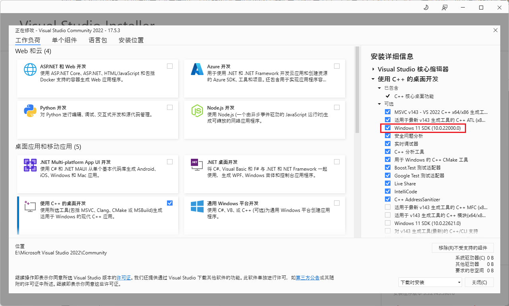

## 源码

### 下载

上面两个依赖配置好之后去官方Github下载需要编译的源码，前面也提到过，我选了v2.12.4版本

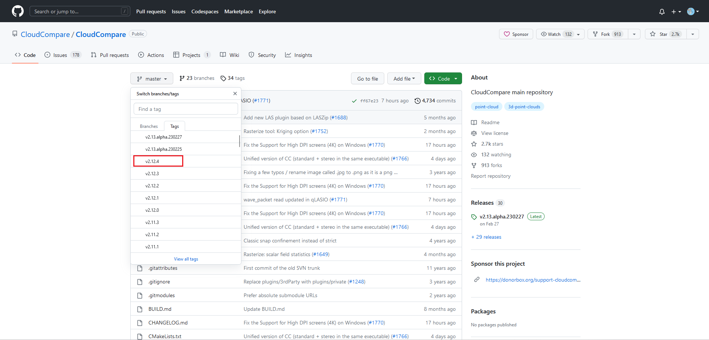

下下来之后要注意这个其实是不完整的，作者把核心算法库单独拿了出来，放在CCCoreLib项目里。

我们直接打开下载下来的文件，找到"CloudCompare/libs/qCC_db/extern/" 目录，会发现里面是空的，但是用Cmake编译的时候他又会报错，告诉你需要这个文件夹中的文件，那如何找到这个项目的位置，只需要在GitHub中找到这个目录的位置，会发现官方在这里给出了超链接，跟着超链接就能找到需要的内容。


点击这个超链接就会跳转到CCCoreLib库的所在，这里直接下载这个默认的即可

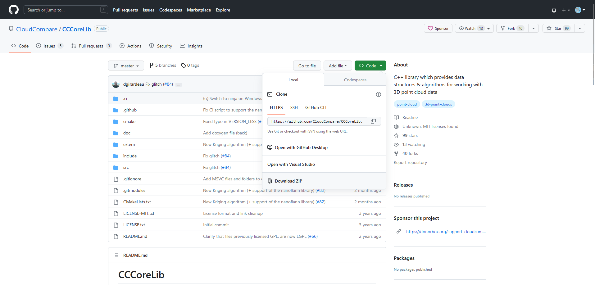

之后将下载下来的文件解压到之前空文件夹的位置即可，后面再细说。

然后这个其实也不是完整的，它里面也有需要去其他地方下载的文件，找到"CCCoreLib/extern/" 目录，发现里面也有个超链接

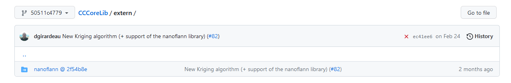

这个下载默认的即可，下载下来解压到对应的目录。

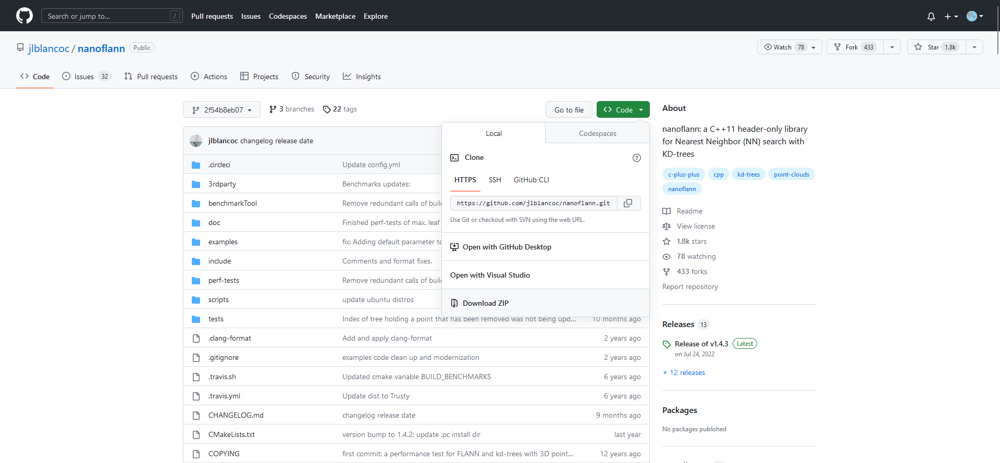


### 组合

下载下来一共3个项目

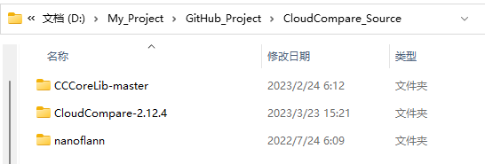

将nanoflann中的内容，全部放到”CCCoreLib-master/extern/nanoflann“目录中

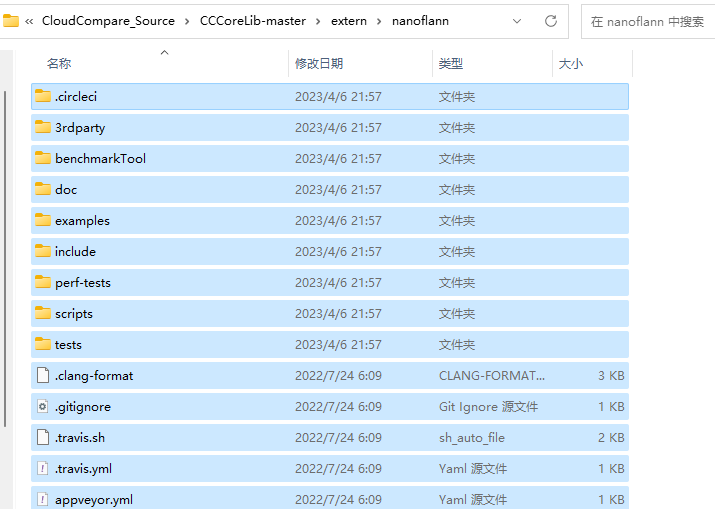

然后再把上面这个组合好的CCCoreLib-master中的内容全部放到”CloudCompare-2.12.4/libs/qCC_db/extern/CCCoreLib“目录里

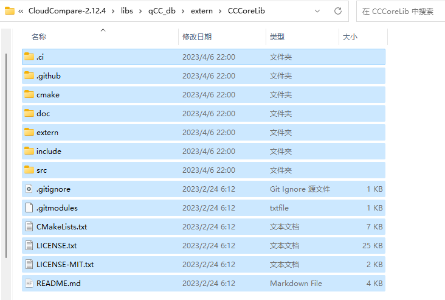

这样才算是得到完整的能够编译的CC文件，后面就用这个CloudCompare-2.12.4文件夹里的内容做Source，用Cmake编译即可。

## 编译

老三样，三个文件夹source、build、install

Cmake编译，记得把install路径改过来

### 配置Qt5路径

主要是配Qt5_DIR的路径，根据自己的Qt5安装路径来配，我的是

```
E:/QT5/5.15.2/msvc2019_64/lib/cmake/Qt5
```

配完这个之后其他的Qt5路径它就自动识别了

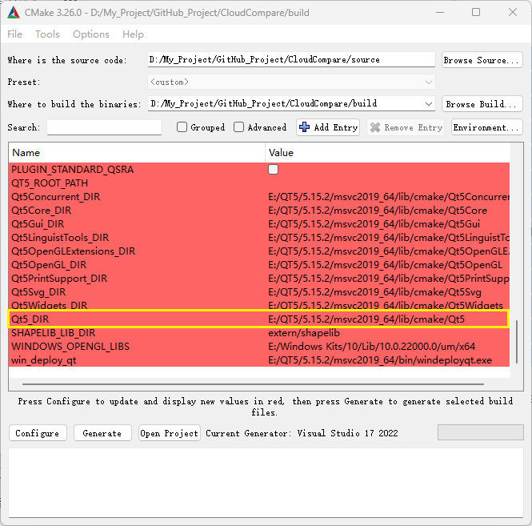

#### Qt5LinguistTools路径

有一个除外，每错，就是这个Qt5LinguistTools的路径，明明安装了，而且也跟它识别到的其他的Qt5组件在一个路径里，不知道它为什么自己找不到，需要我们自己再告诉它一下，路径为

```
E:/QT5/5.15.2/msvc2019_64/lib/cmake/Qt5LinguistTools
```


### 配置OpenGL路径

他其实自己找到了一个路径

```
C:/Program Files (x86)/Windows Kits/8.0/Lib/win8/um/x64
```

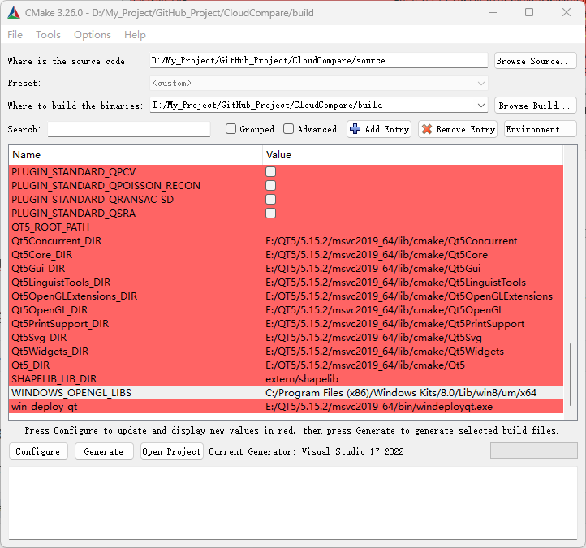

但我看他这个路径名，好像是win8的版本吧。。。我不太放心，就用了前面提到的用VS安装的win11版本的，具体路径为：

```
E:/Windows Kits/10/Lib/10.0.22000.0/um/x64
```

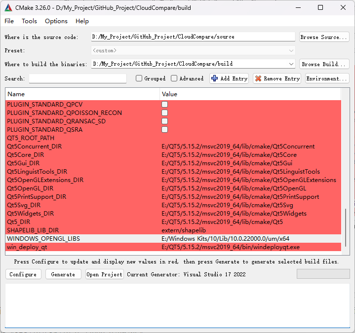

至于具体怎么找到这个路径的，还是用到之前其它教程提到的”everything“，搜索”OpenGL32.lib“，这个文件所在路径即为所求

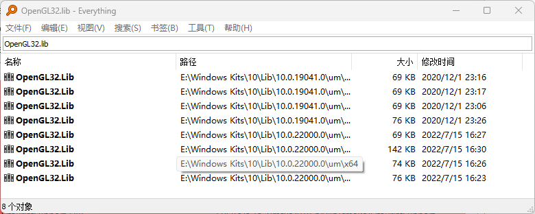

之后就是一路configure、generate、Open Project老三样

然后在VS里”ALL_BUILD“右键生成、”INSTALL“右键生成即可

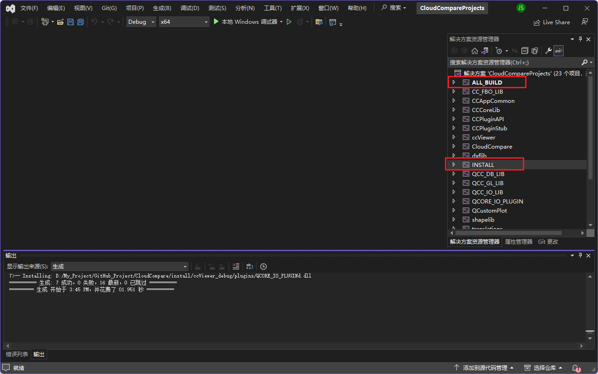


## 编译文件说明

编译前的源代码中有xxx.ui文件，可以通过该文件学习其中的界面布局

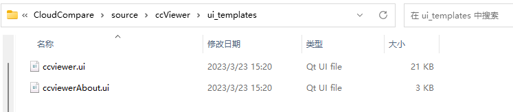

可以通过文本编辑器来打开xxx.ui文件，里面是用xml语言写的布局。

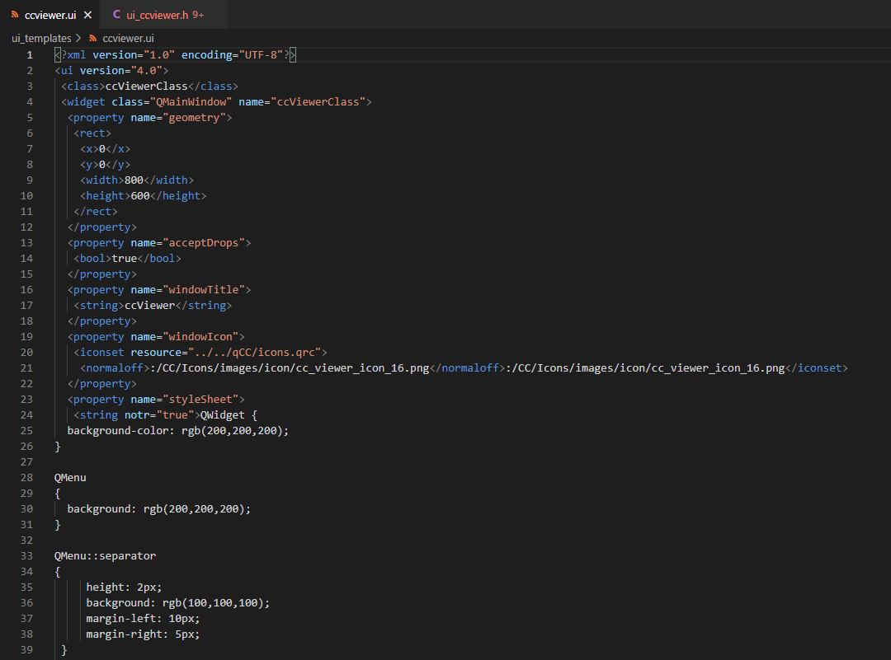

也可以通过Qt Designer打开该xxx.ui文件，直接来看它的布局

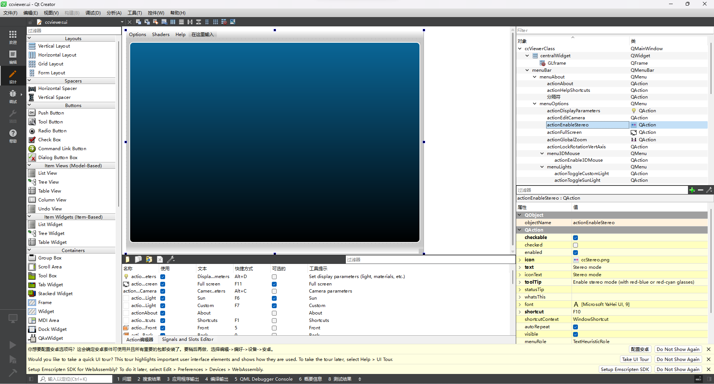

不过上述两种都只能是辅助，比较好的还是要看与xxx.ui文件所对应的ui_xxx.h文件，直接看代码来学，再结合Qt Designer里的布局来学比较好，xml语言还是不太熟，而且一般也不会自己写xml来设计布局吧。。。

而对应的ui_xxx.h文件的生成是靠编译xxx.ui文件产生的，之前我们编译整个项目的时候，它也跟着生成了，编译生成的文件位置就在build文件夹当中

以Source源码中ccViewer子项目中的ccviewer.ui文件为例，其生成的对应的ui_ccviewer.h文件具体位置为` build/ccViewer `

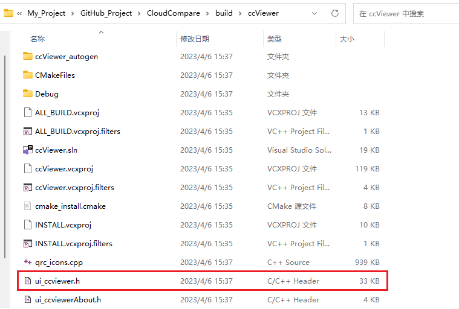

不过根据具体项目的不同，可能具体位置也有点出入，不过都是编译生成再build文件中

具体的可以通过everything来搜索ui_xxx.h来确定具体的位置。

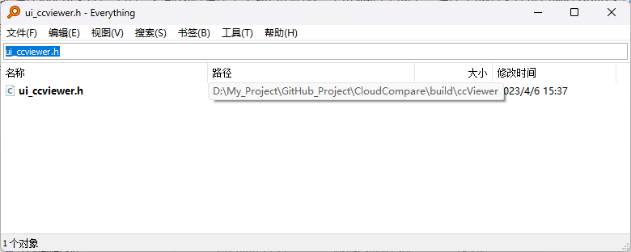
