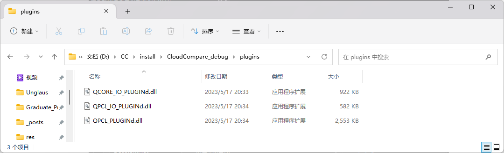

CloudCompare，后续简称CC

## 依赖

### Qt5

CC是基于Qt5开发的，所以编译前需要安装Qt5，具体的Qt5版本根据CC源码的版本可能也有不同，需要自己去看源码中build.md文件说明。我要编译的CC版本是2.12.4，该版本的build.md文件提到2.11+版本之后的Qt版本要求为：5.9 <= Qt < 6.0. 所以我直接安装了Qt5的最新版本Qt5.15.2，就用的官网提供的在线安装包，具体的安装教程见“Qt在线安装包配置国内镜像源”。

### OpenGL（可跳过）

OpenGL其实电脑有自带的，但我看Cmake找到的那个自带的好像是win8版本的，不知道好用不好用，我就给他重新配了之前VS安装的win11版本的。这个OpenGL不用特意装，安装Windows SDK就会带着，通过VS installer就可以安。


## 源码

### 下载

上面两个依赖配置好之后去官方Github下载需要编译的源码，前面也提到过，我选了v2.12.4版本


下下来之后要注意这个其实是不完整的，作者把核心算法库单独拿了出来，放在CCCoreLib项目里。

我们直接打开下载下来的文件，找到"CloudCompare/libs/qCC_db/extern/" 目录，会发现里面是空的，但是用Cmake编译的时候他又会报错，告诉你需要这个文件夹中的文件，那如何找到这个项目的位置，只需要在GitHub中找到这个目录的位置，会发现官方在这里给出了超链接，跟着超链接就能找到需要的内容。


点击这个超链接就会跳转到CCCoreLib库的所在，这里直接下载这个默认的即可


之后将下载下来的文件解压到之前空文件夹的位置即可，后面再细说。

然后这个其实也不是完整的，它里面也有需要去其他地方下载的文件，找到"CCCoreLib/extern/" 目录，发现里面也有个超链接


这个下载默认的即可，下载下来解压到对应的目录。


### 组合

下载下来一共3个项目


将nanoflann中的内容，全部放到”CCCoreLib-master/extern/nanoflann“目录中


然后再把上面这个组合好的CCCoreLib-master中的内容全部放到”CloudCompare-2.12.4/libs/qCC_db/extern/CCCoreLib“目录里


这样才算是得到完整的能够编译的CC文件，后面就用这个CloudCompare-2.12.4文件夹里的内容做Source，用Cmake编译即可。

## 编译

老三样，三个文件夹source、build、install

Cmake编译，记得把install路径改过来

### 配置Qt5路径

主要是配Qt5_DIR的路径，根据自己的Qt5安装路径来配，我的是

```
E:/QT5/5.15.2/msvc2019_64/lib/cmake/Qt5
```

配完这个之后其他的Qt5路径它就自动识别了


#### Qt5LinguistTools路径

有一个除外，每错，就是这个Qt5LinguistTools的路径，明明安装了，而且也跟它识别到的其他的Qt5组件在一个路径里，不知道它为什么自己找不到，需要我们自己再告诉它一下，路径为

```
E:/QT5/5.15.2/msvc2019_64/lib/cmake/Qt5LinguistTools
```

#### 补充

其实只要在环境变量path中，将需要的Qt5版本对应的bin路径配置好，cmake的时候是会自动找到相应Qt5路径的，也不会找不到出现上述找不到Qt5LinguistTools路径的这个问题。


### 配置OpenGL路径（可跳过）

他其实自己找到了一个路径

```
C:/Program Files (x86)/Windows Kits/8.0/Lib/win8/um/x64
```


但我看他这个路径名，好像是win8的版本吧。。。我不太放心，就用了前面提到的用VS安装的win11版本的，具体路径为：

```
E:/Windows Kits/10/Lib/10.0.22000.0/um/x64
```


至于具体怎么找到这个路径的，还是用到之前其它教程提到的”everything“，搜索”OpenGL32.lib“，这个文件所在路径即为所求


**补充：**不过通过后续的实验来看，就用这个默认的就行，不用非得换。。。


### Build

之后就是一路configure、generate、Open Project老三样

然后在VS里”ALL_BUILD“右键生成、”INSTALL“右键生成即可


## 编译文件说明

编译前的源代码中有xxx.ui文件，可以通过该文件学习其中的界面布局


可以通过文本编辑器来打开xxx.ui文件，里面是用xml语言写的布局。


也可以通过Qt Designer打开该xxx.ui文件，直接来看它的布局


不过上述两种都只能是辅助，比较好的还是要看与xxx.ui文件所对应的ui_xxx.h文件，直接看代码来学，再结合Qt Designer里的布局来学比较好，xml语言还是不太熟，而且一般也不会自己写xml来设计布局吧。。。

而对应的ui_xxx.h文件的生成是靠编译xxx.ui文件产生的，之前我们编译整个项目的时候，它也跟着生成了，编译生成的文件位置就在build文件夹当中

以Source源码中ccViewer子项目中的ccviewer.ui文件为例，其生成的对应的ui_ccviewer.h文件具体位置为` build/ccViewer `


不过根据具体项目的不同，可能具体位置也有点出入，不过都是编译生成再build文件中

具体的可以通过everything来搜索ui_xxx.h来确定具体的位置


## 编译PCL插件

测试了一下编译生成的cloudcompare和ccviewer，发现不能读取pcd文件，（而且图标也比安装版的糊，不知道为什么。。。）

通过查阅资料，cc读取pcd文件是通过调用pcl功能实现的，所以在编译时，需要在PLUGIN栏中勾选QPCL选项。


顺便提一嘴，这个GUI界面红色那部分上面有个“Grouped”，把这个勾选上就能将每一项分好组，找起来比较有条理，这里我一开始没选，每一项就都挤在一块了

选了QPCL这一项之后再Configure，就会根据系统环境变量里的PCL路径配置PCL相关的路径


之后再configure，没有问题就generate+open Project即可。

注意这里用的PCL就用官方提供的AllInOne版本安装的一系列PCL文件，不要用自己编译的那些，没有必要。

之后就是在VS中，All_BUILD、INSTALL

检查一下install文件夹中，生成的cc相关exe所在位置是否有**OpenNI2.dll**文件，如果没有，用“everything”找到这个文件，把它复制过来。


至此编译生成的cc和ccviewer就可以读取pcd文件，使用pcl插件的功能了


### 过程中遇到的问题

#### pcl路径的选择

一开始我直接用了之前自己重新编译过的pcl，即E盘下的pcl所在位置：


结果配置好，点configure，报错力：


可能编译的时候有些东西没弄好导致后续像cc这种第三方要调用的时候，一些东西匹配不上，导致报错。

于是我又去pcl官方下了AllInOne版本安装包，并把它安在D盘，稍稍区分一下


安好之后，编译选择pcl路径时都用D盘这个AllInOne版本的，就没有问题，直接就编译通过了。。。

#### 生成的cc.exe读取不了pcd文件

可以看到ALL_BUILD显示全部成功。


INSTALL也都没有问题。


题外话，生成INSTALL的时候可以不要直接右键->生成，而是选仅用于项目->仅生成INSTALL，这样即可在install文件夹中生成相应的目标文件，而且会快很多。上图其实就是仅用于项目->仅生成INSTALL的结果。


但是生成的cc.exe在读取pcd文件时会报错。


而且打开文件选项中也确实找不到pcd选项。


下面就开始了漫长的找问题环节。

##### QPCL_IO_PLUGIN

百度这个问题的时候，一个链接跳转到了cc官方开发人员的一个相同问题的回复，题主也是读取不了pcd文件，但是通过他们问答发现，他其实是没编译QPCL_IO_PLUGIN这部分导致的，但我已经都生成过了，所以其实不是这方面的问题。

不过还是了解到了与读取pcd文件相关的部分，就是生成文件中QPCL_IO_PLUGIN这部分


我还特意去看了install文件夹中，相应位置也都生成了相关的dll文件



然后点开了这部分具体的项目文件来查看（这一看不要紧，后续好多路直接走歪了）


发现QPCL_IO_PLUGIN中的文件有报错，而输出又没显示，ALL_BUILD也都显示是成功，所以一直都被我忽略了。


错误提示为”**C++ 命令行错误: 宏定义无效: BOOST_ALL_NO_LIB-DBOOST_ALL_NO_LIB**“

去查了一下这个问题，通过修改PCL安装目录下cmake目录，里面有个PCLConfig.cmake文件，定位到该文件的第130行。将**if(WIN32 AND NOT MINGW)**替换成**if(WIN32 AND NOT MINGW AND NOT "${BOOST_DEFINITIONS}" MATCHES "BOOST_ALL_NO_LIB")**。这样就不会报上述错误了。


但是编译之后还是不行，仍然没法读PCD格式的文件。

##### SDK（显然不是）

又注意到cmake编译时第一句”Selecting Windows SDK version 10.0.22000.0 to target Windows 10.0.22621.“ 


我去看了一下确实没安Windows 10.0.22621版本的SDK，然后我又去重新安了一下这个版本的SDK


安完这个SDK之后，再来编译发现确实不太一样


但最后结果一样的，还是不行，pcd格式识别不了。

##### VS版本（显然不是）

有人提到说qt5.15.2对应的版本是msvc2019，我用vs2022来编译是不有问题？我一开始是不屑的，但当我死活调不出来时，我也怀疑是不是跟这玄学有点关系？于是我又安了个vs2019来做编译环境，结果一样的，还是不行。然后也提到过我安的东西有点多？可能哪些东西冲突了？具体指什么有点多我其实也不知道。。。一开始我也是不屑的，可还是找不到原因，那快试试吧。然后安了个虚拟机，配了win10的环境，配win10环境是我怀疑是不是win11的编译环境有点问题，然后在安好vs2019、cmake、cc源码、qt5、pcl，只安了编译cc需要的东西，折腾一天多。然后编译出来的cc.exe还是读不了pcd文件。

虽说花了一天多有点亏，但也让我确信，肯定跟上面vs版本、编译环境多之类的问题无关<span style="background:#000000;color:black" >（怎么可能是这种问题。。。真是这种问题我也不是没遇到过，应该是能看出来的，我就是太容易被别人的意见影响，尤其不知道对面深浅的时候，容易把对面的意见当真）</span>

主要是肯定了我之前配置的环境什么的都没有问题，毕竟之前又说我vs版本，又说东西安的有点多，搞得我好像是外行，不知道自己在干嘛一样。。。

后续就是专心找到底是哪里出了问题。

##### GitHub-issues

慢慢学会了去cc官方的GitHub中，有专门的答疑区，即“issues”，其中有各种关于cc这个项目的问题、建议即答疑


通过对其中众多帖子的浏览，找了3、4个相关问题的答疑帖来看，大致有了点思路。

打开自己编译生成的有问题的cc.exe文件，观察下方的控制台输出


比较正常能够读取pcd文件官方下载版的cc.exe来看


这样配合cc开发这的回答，基本可以确认就是这个QPCL_IO_PLUGIN.dll没有被正确识别为插件，导致的没法读取pcd文件。

然后我又针对这个问题开始查资料，cc开发这提到可能是缺少qcl相关的dll导致没有程序没有把QPCL_IO_PLUGIN.dll正确识别为插件。但我去检查了，pcl相关的dll都已经加载到cc.exe所在位置了


cc开发者还提到了一个判断dll缺失的工具“dependency walker”，通过把想要查看的dll或exe拖到该工具中，帮助快速查看缺少哪些dll文件。


但其实到最后我也没搞明白这东西怎么用。。。

##### OpenNI2.dll

最后解决问题还是靠的CSDN上国人写的帖子，他在其中也提到了这种插件加载失败的问题，并给出了解决办法：找不到PCL相关插件的时候，把OpenNI2.dll添加到cc.exe所在位置。

我去看了眼生成的文件中，cc.exe所在位置中的确没有OpenNI2.dll，于是去当时OpenNI2的安装路径中找到该文件（当然是everything来找的），把它复制到了cc.exe所在位置


然后再打开cc.exe，查看支持的打开文件类型，奇迹出现了


再看一眼控制台，这次插件也确实地加载上了


#### 总结

通过上面结果来看，竟然真是缺了OpenNI2.dll导致的。。。难蚌。

所以之前编译等等一系列步骤其实都没有问题，包括前面提到的点开具体QPCL_IO_PLUGIN项目有报错的问题，也不用在意。毕竟ALL_BUILD下面确实都显示成功了。

应该就是OpenNI2这个东西比较“各色”，之前安装pcl的时候它就表现不凡，跟别人的安装过程、位置都不一样。所以在INSTALL的过程中，虽然pcl相关的dll都正常加载到了cc.exe所在的位置，而这个OpenNI2.dll并没有被INSTALL加载过去。不过师兄说他直接编译成功了，那看来他的INSTALL有正确的把OpenNI2.dll加载过去？也可能师兄的环境变量path里配置了OpenNI2的环境？具体不太清楚，可能还有哪里有点问题，导致我的INSTALL没有正确加载OpenNI2.dll。不过鉴于我在舍友电脑、宿舍电脑、虚拟机电脑、工位电脑都试过，结果这个INSTALL都没把OpenNI2.dll加载过去来看，我倾向于是师兄比我多配置了点环境变量（maybe？）。当然也可能就是我哪步有点问题？（不可能啊。。。）

另外从帮我解决问题的CSDN帖子的题主的描述来看，他是通过之前提到“Dependency Walker”检查出来的，但通过我的体验来看，“Dependency Walker”丝毫没有给我提示过缺少OpenNI2.dll的问题。

当然可能是我没学会怎么用，感觉可以后续试着找找资料学一下，就像题主说的：“怎么才能知道exe运行缺什么dll？有时exe自己会提示，但是有些偏不提示，我们也不是神仙，也猜不到，那就用Dependency Walker检查一下”

后续开发遇到相关问题也能比较好下手。

