## OCC安装与编译

### 安装OCC

安装很简单，就是去官网https://dev.opencascade.org/ 下载安装包安装即可。

这里用的是OCC7.6版本。

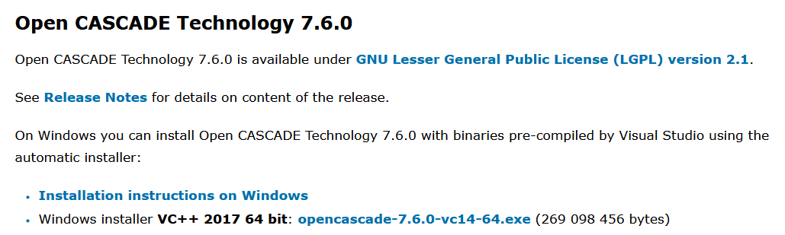

注意：安装的时候路径不要有空格和汉字。

### VS2022编译v142的OCC

安装之后得到的是OCC的编译前的资源文件，而想要使用OCC提供的方法还需要将这些文件进行编译。即编译后得到的文件才是我们使用OCC所必须的。

这里我安装的VS版本为2022，其默认的生成工具是v143，而OCC7.6最新支持的生成工具是v142，所以需要稍微操作一下，使VS2022能编译OCC。

需要注意的是，因为要用到v142生成工具，肯定要保证VS安装了v142的生成工具，没安的话打开Visual Studio Installer安一下即可。

下面是OCC部分编译前的一些操作：
打开安装目录下 \opencascade-7.6.0 目录下的custom.bat，将其中要求的vcvarsall.bat文件所在路径填写完整，该路径跟VS安装的位置有关，下图我的路径配置。题外话，推荐安装一个”notepad++“，轻量级代码编辑器，很好用。

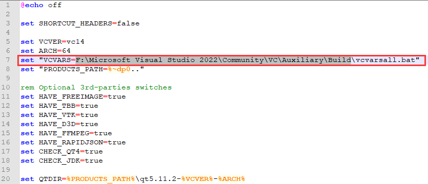

如果实在不知道在哪，可以安装一个软件”everything“，用它来查找vcvarsall.bat的位置即可

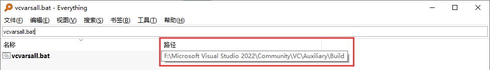

之后，还是在 \opencascade-7.6.0 目录下，打开env.bat，在图示位置添加：`set “VCVER=vc143”`

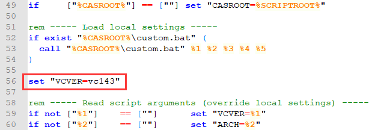

再打开 \opencascade-7.6.0\adm\msvc目录下，复制一份vc142并重命名为vc143，这就是前面提到的，OCC7.6还没有对应的2022版本（vc143）

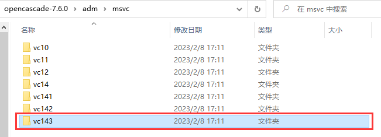

补充：最近在win11新电脑上配的时候发现只配上面几步，在执行后面双击目录 \opencascade-7.6.0下的msvc.bat文件时，没有打开对应的sln文件。所以在这里再加一步，在安装目录下的 \opencascade-7.6.0文件夹，找到msvc.bat，编辑该文件，将第5行的"%1"和"%2"两个参数分别改为"vc143"和"win64"，如下图。改完保存退出。

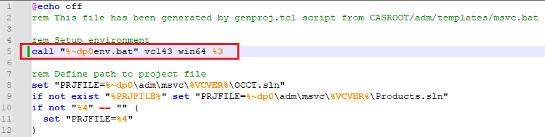

至此准备工作结束，可以用VS2022编译OCC7.6了

双击刚才编辑完的msvc.bat，它会根据前面的配置打开对应版本的OCCT.sln，打开后会需要确认是否升级平台工具集，记得选择”无升级“。

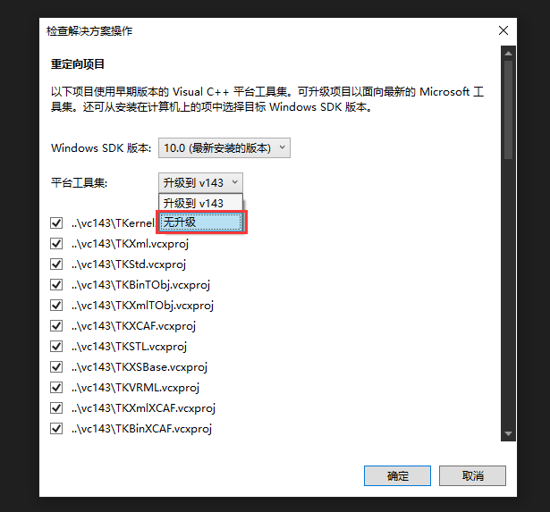

之后找到“解决方案资源管理器”，右键“解决方案”，选择“生成解决方案”即可

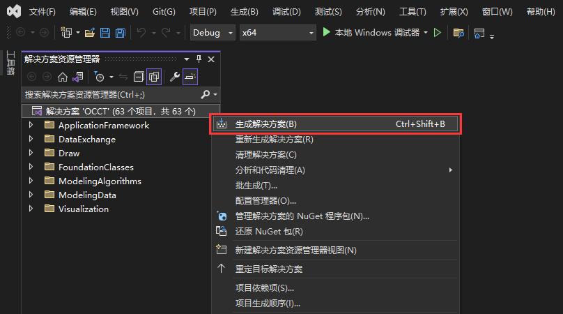

等待VS编译完成

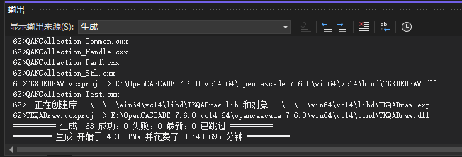

编译完成后生成的文件在 \opencascade-7.6.0\win64\vc14 目录下

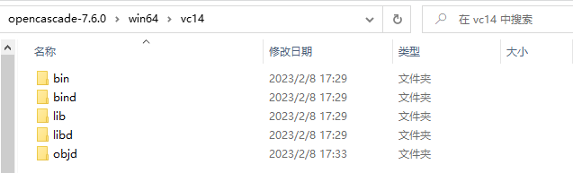

其中的bind文件夹、libd文件夹中的文件是我们使用OCC所必需的的文件。一般是bin文件夹和lib文件夹，不过在OCC这里是bind和libd，应该是分别表示bin和lib的debug版本。因为我一直用的debug版本调试，找的教程也都是说配bind和libd的，不太清楚这个bin和lib是不是在release版本下用的，等之后如果用到release调试的时候试一下看看，等试过之后再来补充。

libd文件夹，存放程序运行时所需要的lib文件，lib文件是指程序库（library）文件，也称为静态链接库（static library），它包含了一组可在程序中共享的函数和资源的代码。

bind文件夹，存放运行lib时所必需的的dll文件，DLL（Dynamic Link Library）是一种可执行文件格式，它包含一组可在多个程序中共享的函数和资源。它通常被用于在 Windows 操作系统中实现共享库和插件的功能。一个 DLL 文件可以包含多个函数和资源，其他程序可以通过动态链接库（Dynamic Link Library）的方式调用 DLL 文件中的函数。

## VS中配置OCC环境

前面也提到，我们所需的bind文件夹和libd文件夹生成好了之后，就可以配置在VS中使用OCC所需的一些属性，像OCC、PCL、VTK这种C++的库，其项目属性配置基本都是一致的，基本就是三步走。

第一步，将dll文件所在路径，在OCC这里即是上述提到的bind文件夹路径，添加到系统环境变量Path中

有时候更改完环境变量之后可能需要重启一下电脑才能生效。

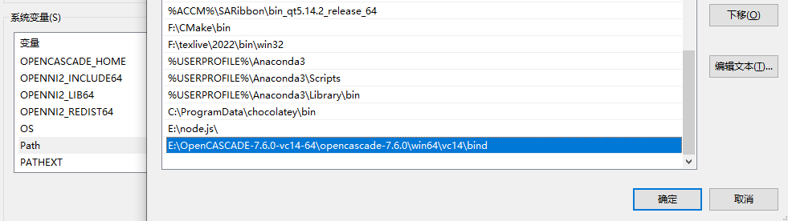

再补充一点，上面加的这个环境变量只是最基本的，有时候程序调的OCC函数可能用到它自带的其他第三方库函数，这时可能会报缺少xxx.dll文件的错误，这时候就用”everything“查找该文件名，然后把该文件所在路径加到上面的环境变量里就行。比如这里程序运行时提示我缺少"tbb_debug.dll"，我就去搜这个文件，发现有很多该文件，选一个觉得最靠谱的文件路径添加到上面环境变量Path里就行。我这里看这个文件夹路径是vc14，感觉应该是适配vc14x版本的dll文件，我就选了这个。

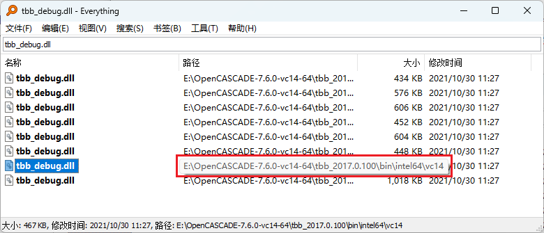

之后在我们所建的项目中，在解决方案栏中，右键点击项目，选择属性一栏

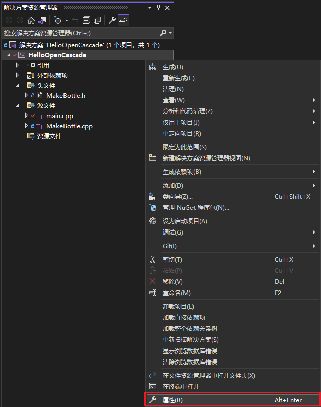

在属性页找到 调试—>环境，输入 `PATH=%PATH%` ，使调试时能找到环境变量中bind所在路径，进一步能找到dll文件

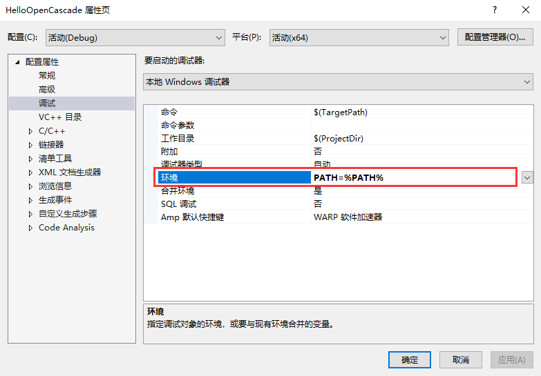

第二步，在属性页中找到 链接器—>常规—>附加库目录，将libd所在路径添加进去，方便编译器编译时能找到lib文件

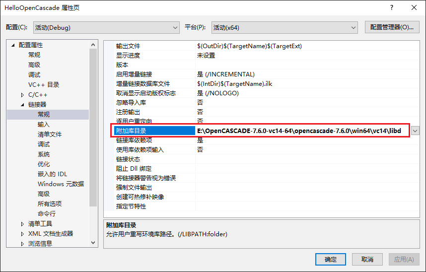

再找到 链接器—>输入—>附加依赖项，将libd文件夹下所有的lib文件添加进去

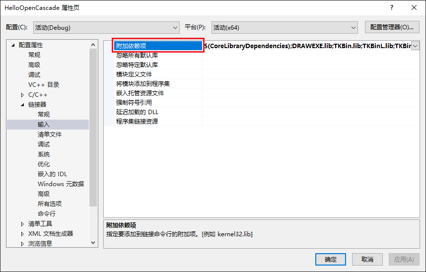

至于如何快速取得文件夹下所有lib文件列表，找到目标文件夹libd，在该文件夹下“shift+右键”，选择 Powershell打开

在该命令窗口输入 `ls *.lib -n`，即可得到该文件夹下所有lib结尾的文件列表，其中`-n`是指定列出来的信息只包含文件名和后缀，可以自己试试不带`-n`的结果

第三步，在属性页找到 C/C++—>常规—>附加库包含目录，将OCC的头文件路径添加进去，该路径为安装目录下 \opencascade-7.6.0\inc ，其中存放的是在使用OCC时所需的所有头文件

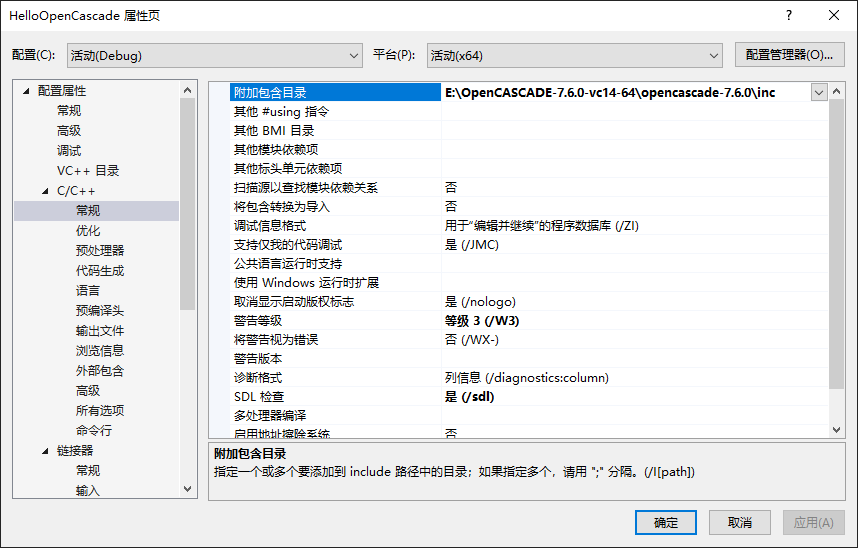

上面三步无关顺序，能配完就行。

至此，就可以在C++程序中使用OCC提供的各种功能啦，开始愉快编程啦~

## VS属性表的使用

### 新建属性表

上面配置的VS属性页只针对当前项目有效，如果要新建项目并使用OCC，需要将上面的三个步骤再配置一遍，很不方便。而使用VS属性表就可以实现只用配置一次，下次直接拿来用即可的效果

在VS窗口上边菜单栏找到 视图—>其他窗口—>属性管理器

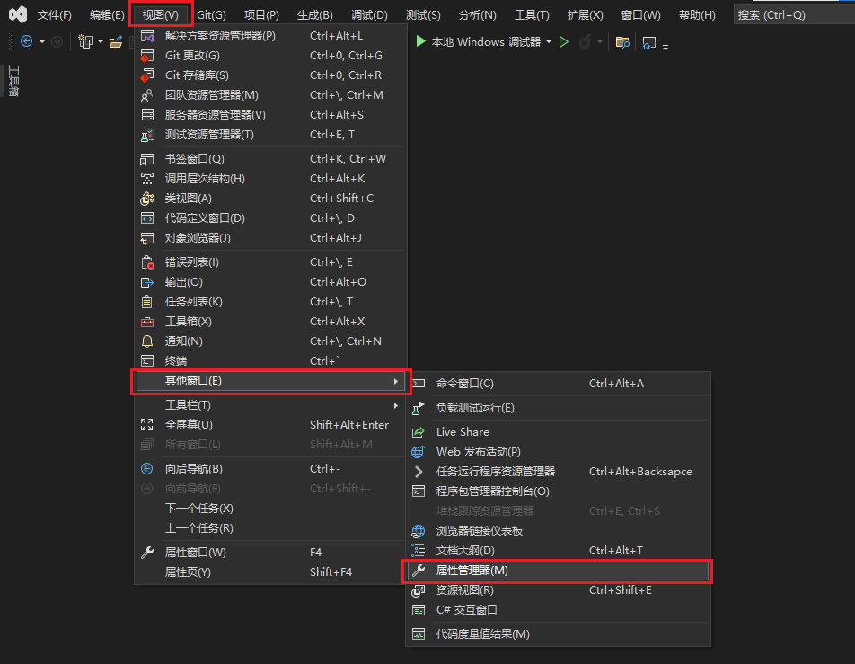

选择之后，属性管理器就会出现在解决方案管理器旁边的位置

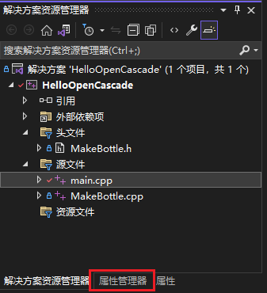

找到自己需要的版本，比如我一般使用Debug|x64版本，我就在对应项旁边右键，选择 添加新项目属性表

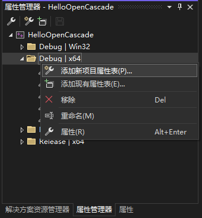

因为是给OCC配置的属性表，就叫OCC.props吧，至于这个位置，它默认是建在当前项目所在的文件夹中，可以自定义一个文件夹位置，就光用来存这种属性表，当时候项目中需要哪个属性表，就直接去那个文件夹中好就行。

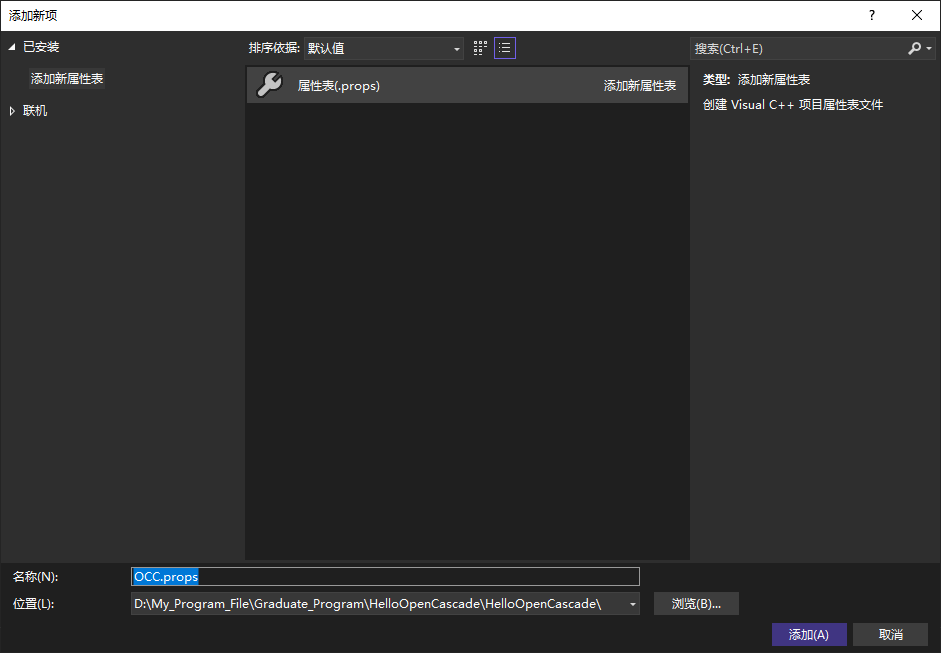

在建好的属性表里，把前面第二步、第三步里，关于“C/C++”和“链接器”选项中的部分复现一下即可，简单概括就是“C/C++”的附加包含目录里添加头文件目录，”链接器“的附加库目录里添加lib库路径、附加依赖项里把lib库中的所有lib添加进去。

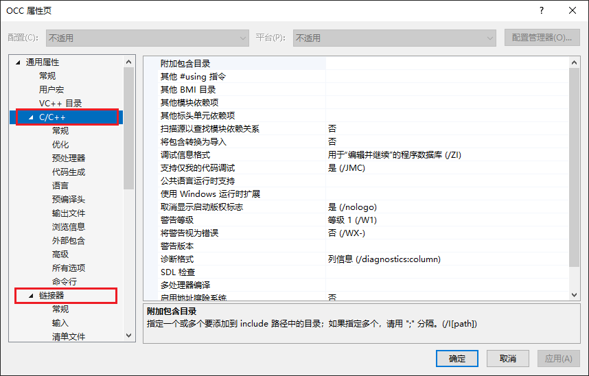

可以看到这个属性表里没有第一步中“调试”选项，所以在 调试—>环境，输入 `PATH=%PATH%` 这一步还是需要在具体的新建项目中配置一下，步骤参考前面第一步。

### 使用已有属性表

上面属性表建好之后，下次新的项目要是用OCC的时候，直接把这个属性表引入即可

在属性管理器，要是用的对应版本处右键点击，选择 添加现有属性页

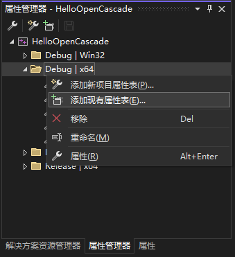

找到之前建好的属性表，添加即可

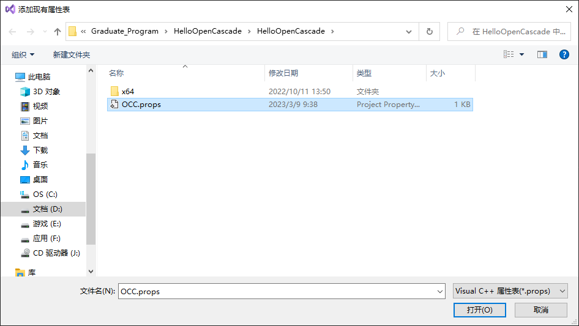

需要注意的是，通过这种添加现有项方式加入的属性表并不是把之前建的表复制了一个放在新项目里，新项目中是找不到这个属性表文件的，它实际还是之前建的那个属性表，只是编译器把它链接了过来，使我们可以使用该表的配置。这也意味着你如果在对这个属性表进行改动，会影响到所有使用该属性表的项目，一定要注意。

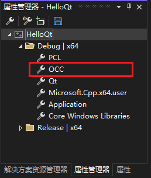

当然，其实也可以将之前建的属性表复制一个到新建项目的文件夹里，然后在添加现有项时添加当前这一个，这样就可以随便改了，也不会对别的项目有什么影响。

以上。
