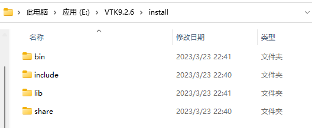

本教程分为两部分，第一部分为PCL+VS的配置，第二部分为PCL+VS+QT的配置。

如果只是要在VS用用PCL，学习一下PCL点云库，只看第一部分PCL+VS的配置即可。

而如果还需要配合QT做界面，相关的配置会在第二部分PCL+VS+QT的配置中介绍。


# PCL+VS 配置

## PCL安装

### 前言

PCL（Point Cloud Library）官方网站 https://pointclouds.org/

官方github网站 https://github.com/PointCloudLibrary/pcl

PCL官方的github提供了各种版本的PCL源码，同时还提供了已经编译好的PCL供使用。

解释一下，PCL正常来配置的话，是需要自己安装PCL依赖的第三方库，一般有Boost、Eigen、FLANN、OpenNI2、Qhull、VTK，我们需要将这些第三方库从各自官网下载下来，分别用Cmake编译好，然后再编译PCL的源码，因为PCL编译时要依赖上述第三库编译出的文件，包括库文件（library）等二进制文件。这样的优势在于编译PCL的时候可以自选PCL的一些组件，比如可以指定PCL的GPU加速模块（默认是不带的），还可以指定要与Qt6配合使用，它应该就会在编译时往与Qt6适配这方面有进一步的优化。但缺点就是麻烦，要把上面每一个第三方库都安装编译一遍可不是一般的麻烦，而且各个第三方库版本之间的兼容性、适配度也需要自己摸索。

所以官方也提供了已经完全编译好的PCL安装包供我们使用，该安装包包含上述的所有第三方库编译好的文件，以及依赖它们所编译好的PCL文件。当然，官方提供的这种安装包得到的PCL只提供了最基本的功能，不含GPU模块等扩展。而且其中所带的第三库也都是最基本的配置，就比如其中自带的VTK，就没有针对Qt6做额外的配置，缺少与Qt6配合所需的文件。

因此，个人认为，最佳的PCL配置安装路线是，1、先使用官方提供的AllInOn安装包，就是之前提过的官方提供的自带编译好的第三方库及编译好的PCL的安装包。补充一下，这个安装包自带的第三方库安好后，从各自的文件夹名字基本能得知每个第三库的版本，即我们可以从中得知当前PCL版本要与第三方库的哪些版本配合兼容性好。2、根据自己的需求，自己安装编译对应版本的第三方库，并用它替换掉PCL自带的对应部分的第三方库。就比如，我要使用VTK配合Qt的组件，而PCL自带的VTK显然不带与Qt配合的部分。因此我去VTK官网自己下一个VTK源码，并自己编译，编译时配置与Qt配合，那我得到的编译后的文件就带有我所需的与Qt配合的部分。之后我用我自己编译好的VTK文件（包括bin、lib、include等），把PCL自带的VTK的这些文件都替换掉。当然，如果没有这类需求，只是想自己编译一下PCL，比如自己编译PCL增加一个GPU模块，那这第2步就没有必要。3、前面是编译PCL的准备步骤，准备好PCL编译所依赖的第三方库文件（编译好的），下面就是编译PCL，去官网下载对应版本的PCL源码，使用CMake编译即可，编译的时候绑定好这些第三方库的位置、选好要用的PCL模块。具体操作见本教程第二部分“PCL+VS+QT 配置” 。

### 官方编译版安装

下面开始官方编译版PCL的安装教程，因为如果只是配合VS来学习PCL库，安这个也就够用了，有进一步的自定义需求的可以接着看第二部分。

在官方github网站（PCL项目）的右侧找到Releases部分


他这里把最新的版本放在前面，可以看到是PCL1.13.0版本，如果想安装其他版本就点“+30 releases”去找自己想安的版本，因为我之前安装的是PCL1.12.1，所以我还是以该版本为例来写。


点开相应版本下的“Assets”，就能看到具体提供的安装资源，其中的AllInOne安装包就是官方提供的编译好的第三方库及PCL文件。


之后点击安装即可，这里提点安装时的个人小建议，一是选择添加环境变量到PATH，能为后面配环境变量省一点事儿


然后是选择安装路径的时候，官方自动给的路径中“PCL 1.12.1”里面有个空格，为了方便后续编译PCL时的方便，建议把这个空格去掉，或是换成下划线之类的，总之路径里最后不要有空格，中文最好也别有（这个没试过，可能没事）


重要！！！后来我发现相比下划线"PCL_1.12.1"，用横杠更好看"PCL-1.12.1"，仅供参考。<span style="background:#000000;color:black">等之后找个空把我要把这些路径名都改过来。</span>

然后在安装过程中如果之前没有安装过OpenNI2，会弹出窗口问是否安装OpenNI2，点击安装即可。


 比较坑的是，这个OpenNI2一般不会老老实实按照我们PCL安装路径安装，而是安装在C盘。不过也不用在意，等PCL安装程序全部安装完成后，找到安装目录\PCL_1.12.1\3rdParty，该目录下就是PCL官方为我们打包好的，编译好的第三方库


打开其中的OpenNI2目录，如果里面是空的，只有一个OpenNI-Windows-x64-2.2.msi文件，那恭喜，这东西成功安到C盘去了。。。


但不用担心，这个msi文件就是OpenNI2的安装文件，我们可以通过它，把安在C盘的OpenNI2卸载


然后再通过这个msi把它安装回来，主要是因为通过这个msi文件来安装的时候，它会让你选安装路径，我们就把安到\PCL_1.12.1\3rdParty\OpenNI2路径，这样就让PCL的第三库整整齐齐在一起了。


现在再看OpenNI2的文件夹，这就正常了。


当然，不介意OpenNI2安在C盘，与其他第三方库天各一方的话，就不用把它卸了又装。

现在打开系统环境变量来看一下，因为我们之前选择了添加PCL环境变量到PATH，所以这里已经自动帮我们配好了一部分。

在系统变量里帮我们配好了OPENNI2的三个相关变量（外：PCL_ROOT,OpenNI2三项；Path内：PCL/bin，VTK/bin）


在Path里帮我们配好了最基本的PCL和VTK的bin路径


除了他帮我们配好的这一部分，我们还需要把其他第三方库跟dll有关的路径添加上

```
%PCL_ROOT%\3rdParty\FLANN\bin
%PCL_ROOT%\3rdParty\Qhull\bin
%PCL_ROOT%\3rdParty\OpenNI2\Tools
%PCL_ROOT%\3rdParty\OpenNI2\Redist
```

另外因为他给我们配好PCL_ROOT了，可以直接拿来用


一开始我以为我没用到上面的模块，这些环境变量没必要加，结果不加它们在运行的时候报了缺少OpenNI2.dll的错误，所以我估计虽然没有直接使用这些第三方库，但PCL毕竟是依赖它们编译出来的，在运行时估计还是需要用到这些东西，所以还是把上面这些都加到环境变量里吧。

对了，既然说到这了，提供一种程序运行时出现缺少xxx.dll文件时的解决思路


这种一般就是程序调试的时候找不到相关的dll导致的<span style="background:#000000;color:black">（废话。。。）</span>，所以我们首先要找到这个dll的位置，还是通过之前的软件“everything”，查找到这个dll所在位置


之后有两种办法 ，一是直接将这个dll文件复制到程序运行目录下，二是将这个dll文件所在的路径添加到环境变量Path中，然后在VS的调试属性中告诉它去哪里找这些dll文件。上面这么多路径，选一个加到环境变量里即可。


在这个例子里，通过网上的参考，只要把下面两个路径加到环境变量里，应该就包含OpenNI2所需的所有dll文件了。

```
%PCL_ROOT%\3rdParty\OpenNI2\Tools
%PCL_ROOT%\3rdParty\OpenNI2\Redist
```

而在不知道哪个路径里包含程序运行所需的所有dll文件的情况下，就只能是缺一个，找个一路径加一下这样。。。当然，因为你加的路径里包含多个dll文件，在有多个dll路径可选的时候，是有可能你选的那个路径，就是包含你当前程序运行所需的所有dll文件的路径。提这个就是想说，选哪个路径加到环境变量里的时候，还是可以稍微思考一下的，哎嘿。

题外话，不过让我纳闷的是，上面配置的所有PCL相关环境时，里面没有Boost相关的环境变量，甚至我程序中都显式地使用了Boost相关的代码，它也没报过缺少dll文件的错。而且其实在第三方库Boost的安装路径\PCL_1.12.1\3rdParty\Boost里，可以看到是没有bin文件夹的，找了找也没有像OpenNI2那样把dll分散到别的文件夹里，Boost好像就是没有dll文件。看样Boost在使用时跟别人都不一样，不需要这个dll文件就能用。这一段是见识短的我的一点小感慨，等我见识长了，看看能不能有什么新的认识补充。

## VS配置

跟之前OCC在VS中的配置类似，主要三个部分。让程序能找到bin里的dll文件，找到inc里的.h头文件，找到lib里的lib库函数。

如何让程序能找到bin里的dll文件在上面已经给出了，就是在属性页的 “调试-->环境” 里添加`PATH=%PATH%`，不过感觉不加好像也行，一般程序创建的时候都带着。

让程序能找到头文件，添加PCL所有关联的头文件目录。找到 属性页 -> "C/C++" -> "常规"->"附加包含目录"，把这些头文件路径添加进去即可。


```
E:\PCL_1.12.1\include\pcl-1.12
E:\PCL_1.12.1\3rdParty\Boost\include\boost-1_78
E:\PCL_1.12.1\3rdParty\Eigen\eigen3
E:\PCL_1.12.1\3rdParty\FLANN\include
E:\PCL_1.12.1\3rdParty\OpenNI2\Include
E:\PCL_1.12.1\3rdParty\Qhull\include
E:\PCL_1.12.1\3rdParty\VTK\include\vtk-9.1
```

让程序能找到lib文件，找到属性页->"链接器"->"常规"->"附加库目录"，添加lib库位置。


```
E:\PCL_1.12.1\lib
E:\PCL_1.12.1\3rdParty\Boost\lib
E:\PCL_1.12.1\3rdParty\FLANN\lib
E:\PCL_1.12.1\3rdParty\OpenNI2\Lib
E:\PCL_1.12.1\3rdParty\Qhull\lib
E:\PCL_1.12.1\3rdParty\VTK\lib
```

然后还是在链接器部分，找到“输入”->"附加依赖项"，把上面所有lib库路径下的lib文件名引入到附加依赖项里


之前配OCC的时候提过了，在每个lib文件夹下，shift+右键，选择打开Powershell窗口，然后通过命令行`ls *.lib -n`来获取各个文件夹下的所有lib文件名即可。这里直接给出该PCL版本下所以的lib文件

```
pcl_commond.lib
pcl_featuresd.lib
pcl_filtersd.lib
pcl_iod.lib
pcl_io_plyd.lib
pcl_kdtreed.lib
pcl_keypointsd.lib
pcl_mld.lib
pcl_octreed.lib
pcl_outofcored.lib
pcl_peopled.lib
pcl_recognitiond.lib
pcl_registrationd.lib
pcl_sample_consensusd.lib
pcl_searchd.lib
pcl_segmentationd.lib
pcl_stereod.lib
pcl_surfaced.lib
pcl_trackingd.lib
pcl_visualizationd.lib
libboost_atomic-vc142-mt-gd-x64-1_78.lib
libboost_bzip2-vc142-mt-gd-x64-1_78.lib
libboost_chrono-vc142-mt-gd-x64-1_78.lib
libboost_container-vc142-mt-gd-x64-1_78.lib
libboost_context-vc142-mt-gd-x64-1_78.lib
libboost_contract-vc142-mt-gd-x64-1_78.lib
libboost_coroutine-vc142-mt-gd-x64-1_78.lib
libboost_date_time-vc142-mt-gd-x64-1_78.lib
libboost_exception-vc142-mt-gd-x64-1_78.lib
libboost_filesystem-vc142-mt-gd-x64-1_78.lib
libboost_graph-vc142-mt-gd-x64-1_78.lib
libboost_graph_parallel-vc142-mt-gd-x64-1_78.lib
libboost_iostreams-vc142-mt-gd-x64-1_78.lib
libboost_json-vc142-mt-gd-x64-1_78.lib
libboost_locale-vc142-mt-gd-x64-1_78.lib
libboost_log-vc142-mt-gd-x64-1_78.lib
libboost_log_setup-vc142-mt-gd-x64-1_78.lib
libboost_math_c99-vc142-mt-gd-x64-1_78.lib
libboost_math_c99f-vc142-mt-gd-x64-1_78.lib
libboost_math_c99l-vc142-mt-gd-x64-1_78.lib
libboost_math_tr1-vc142-mt-gd-x64-1_78.lib
libboost_math_tr1f-vc142-mt-gd-x64-1_78.lib
libboost_math_tr1l-vc142-mt-gd-x64-1_78.lib
libboost_mpi-vc142-mt-gd-x64-1_78.lib
libboost_nowide-vc142-mt-gd-x64-1_78.lib
libboost_numpy38-vc142-mt-gd-x64-1_78.lib
libboost_prg_exec_monitor-vc142-mt-gd-x64-1_78.lib
libboost_program_options-vc142-mt-gd-x64-1_78.lib
libboost_python38-vc142-mt-gd-x64-1_78.lib
libboost_random-vc142-mt-gd-x64-1_78.lib
libboost_regex-vc142-mt-gd-x64-1_78.lib
libboost_serialization-vc142-mt-gd-x64-1_78.lib
libboost_system-vc142-mt-gd-x64-1_78.lib
libboost_test_exec_monitor-vc142-mt-gd-x64-1_78.lib
libboost_thread-vc142-mt-gd-x64-1_78.lib
libboost_timer-vc142-mt-gd-x64-1_78.lib
libboost_type_erasure-vc142-mt-gd-x64-1_78.lib
libboost_unit_test_framework-vc142-mt-gd-x64-1_78.lib
libboost_wave-vc142-mt-gd-x64-1_78.lib
libboost_wserialization-vc142-mt-gd-x64-1_78.lib
libboost_zlib-vc142-mt-gd-x64-1_78.lib
flann-gd.lib
flann_cpp-gd.lib
flann_cpp_s-gd.lib
flann_s-gd.lib
OpenNI2.lib
qhullcpp_d.lib
qhullstatic_d.lib
qhullstatic_rd.lib
qhull_rd.lib
vtkcgns-9.1.lib
vtkcgns-9.1d.lib
vtkChartsCore-9.1.lib
vtkChartsCore-9.1d.lib
vtkCommonColor-9.1.lib
vtkCommonColor-9.1d.lib
vtkCommonComputationalGeometry-9.1.lib
vtkCommonComputationalGeometry-9.1d.lib
vtkCommonCore-9.1.lib
vtkCommonCore-9.1d.lib
vtkCommonDataModel-9.1.lib
vtkCommonDataModel-9.1d.lib
vtkCommonExecutionModel-9.1.lib
vtkCommonExecutionModel-9.1d.lib
vtkCommonMath-9.1.lib
vtkCommonMath-9.1d.lib
vtkCommonMisc-9.1.lib
vtkCommonMisc-9.1d.lib
vtkCommonSystem-9.1.lib
vtkCommonSystem-9.1d.lib
vtkCommonTransforms-9.1.lib
vtkCommonTransforms-9.1d.lib
vtkDICOMParser-9.1.lib
vtkDICOMParser-9.1d.lib
vtkDomainsChemistry-9.1.lib
vtkDomainsChemistry-9.1d.lib
vtkDomainsChemistryOpenGL2-9.1.lib
vtkDomainsChemistryOpenGL2-9.1d.lib
vtkdoubleconversion-9.1.lib
vtkdoubleconversion-9.1d.lib
vtkexodusII-9.1.lib
vtkexodusII-9.1d.lib
vtkexpat-9.1.lib
vtkexpat-9.1d.lib
vtkFiltersAMR-9.1.lib
vtkFiltersAMR-9.1d.lib
vtkFiltersCore-9.1.lib
vtkFiltersCore-9.1d.lib
vtkFiltersExtraction-9.1.lib
vtkFiltersExtraction-9.1d.lib
vtkFiltersFlowPaths-9.1.lib
vtkFiltersFlowPaths-9.1d.lib
vtkFiltersGeneral-9.1.lib
vtkFiltersGeneral-9.1d.lib
vtkFiltersGeneric-9.1.lib
vtkFiltersGeneric-9.1d.lib
vtkFiltersGeometry-9.1.lib
vtkFiltersGeometry-9.1d.lib
vtkFiltersHybrid-9.1.lib
vtkFiltersHybrid-9.1d.lib
vtkFiltersHyperTree-9.1.lib
vtkFiltersHyperTree-9.1d.lib
vtkFiltersImaging-9.1.lib
vtkFiltersImaging-9.1d.lib
vtkFiltersModeling-9.1.lib
vtkFiltersModeling-9.1d.lib
vtkFiltersParallel-9.1.lib
vtkFiltersParallel-9.1d.lib
vtkFiltersParallelImaging-9.1.lib
vtkFiltersParallelImaging-9.1d.lib
vtkFiltersPoints-9.1.lib
vtkFiltersPoints-9.1d.lib
vtkFiltersProgrammable-9.1.lib
vtkFiltersProgrammable-9.1d.lib
vtkFiltersSelection-9.1.lib
vtkFiltersSelection-9.1d.lib
vtkFiltersSMP-9.1.lib
vtkFiltersSMP-9.1d.lib
vtkFiltersSources-9.1.lib
vtkFiltersSources-9.1d.lib
vtkFiltersStatistics-9.1.lib
vtkFiltersStatistics-9.1d.lib
vtkFiltersTexture-9.1.lib
vtkFiltersTexture-9.1d.lib
vtkFiltersTopology-9.1.lib
vtkFiltersTopology-9.1d.lib
vtkFiltersVerdict-9.1.lib
vtkFiltersVerdict-9.1d.lib
vtkfmt-9.1.lib
vtkfmt-9.1d.lib
vtkfreetype-9.1.lib
vtkfreetype-9.1d.lib
vtkGeovisCore-9.1.lib
vtkGeovisCore-9.1d.lib
vtkgl2ps-9.1.lib
vtkgl2ps-9.1d.lib
vtkglew-9.1.lib
vtkglew-9.1d.lib
vtkhdf5-9.1.lib
vtkhdf5-9.1d.lib
vtkhdf5_hl-9.1.lib
vtkhdf5_hl-9.1d.lib
vtkImagingColor-9.1.lib
vtkImagingColor-9.1d.lib
vtkImagingCore-9.1.lib
vtkImagingCore-9.1d.lib
vtkImagingFourier-9.1.lib
vtkImagingFourier-9.1d.lib
vtkImagingGeneral-9.1.lib
vtkImagingGeneral-9.1d.lib
vtkImagingHybrid-9.1.lib
vtkImagingHybrid-9.1d.lib
vtkImagingMath-9.1.lib
vtkImagingMath-9.1d.lib
vtkImagingMorphological-9.1.lib
vtkImagingMorphological-9.1d.lib
vtkImagingSources-9.1.lib
vtkImagingSources-9.1d.lib
vtkImagingStatistics-9.1.lib
vtkImagingStatistics-9.1d.lib
vtkImagingStencil-9.1.lib
vtkImagingStencil-9.1d.lib
vtkInfovisCore-9.1.lib
vtkInfovisCore-9.1d.lib
vtkInfovisLayout-9.1.lib
vtkInfovisLayout-9.1d.lib
vtkInteractionImage-9.1.lib
vtkInteractionImage-9.1d.lib
vtkInteractionStyle-9.1.lib
vtkInteractionStyle-9.1d.lib
vtkInteractionWidgets-9.1.lib
vtkInteractionWidgets-9.1d.lib
vtkIOAMR-9.1.lib
vtkIOAMR-9.1d.lib
vtkIOAsynchronous-9.1.lib
vtkIOAsynchronous-9.1d.lib
vtkIOCGNSReader-9.1.lib
vtkIOCGNSReader-9.1d.lib
vtkIOChemistry-9.1.lib
vtkIOChemistry-9.1d.lib
vtkIOCityGML-9.1.lib
vtkIOCityGML-9.1d.lib
vtkIOCONVERGECFD-9.1.lib
vtkIOCONVERGECFD-9.1d.lib
vtkIOCore-9.1.lib
vtkIOCore-9.1d.lib
vtkIOEnSight-9.1.lib
vtkIOEnSight-9.1d.lib
vtkIOExodus-9.1.lib
vtkIOExodus-9.1d.lib
vtkIOExport-9.1.lib
vtkIOExport-9.1d.lib
vtkIOExportGL2PS-9.1.lib
vtkIOExportGL2PS-9.1d.lib
vtkIOExportPDF-9.1.lib
vtkIOExportPDF-9.1d.lib
vtkIOGeometry-9.1.lib
vtkIOGeometry-9.1d.lib
vtkIOHDF-9.1.lib
vtkIOHDF-9.1d.lib
vtkIOImage-9.1.lib
vtkIOImage-9.1d.lib
vtkIOImport-9.1.lib
vtkIOImport-9.1d.lib
vtkIOInfovis-9.1.lib
vtkIOInfovis-9.1d.lib
vtkIOIOSS-9.1.lib
vtkIOIOSS-9.1d.lib
vtkIOLegacy-9.1.lib
vtkIOLegacy-9.1d.lib
vtkIOLSDyna-9.1.lib
vtkIOLSDyna-9.1d.lib
vtkIOMINC-9.1.lib
vtkIOMINC-9.1d.lib
vtkIOMotionFX-9.1.lib
vtkIOMotionFX-9.1d.lib
vtkIOMovie-9.1.lib
vtkIOMovie-9.1d.lib
vtkIONetCDF-9.1.lib
vtkIONetCDF-9.1d.lib
vtkIOOggTheora-9.1.lib
vtkIOOggTheora-9.1d.lib
vtkIOParallel-9.1.lib
vtkIOParallel-9.1d.lib
vtkIOParallelXML-9.1.lib
vtkIOParallelXML-9.1d.lib
vtkIOPLY-9.1.lib
vtkIOPLY-9.1d.lib
vtkIOSegY-9.1.lib
vtkIOSegY-9.1d.lib
vtkIOSQL-9.1.lib
vtkIOSQL-9.1d.lib
vtkioss-9.1.lib
vtkioss-9.1d.lib
vtkIOTecplotTable-9.1.lib
vtkIOTecplotTable-9.1d.lib
vtkIOVeraOut-9.1.lib
vtkIOVeraOut-9.1d.lib
vtkIOVideo-9.1.lib
vtkIOVideo-9.1d.lib
vtkIOXML-9.1.lib
vtkIOXML-9.1d.lib
vtkIOXMLParser-9.1.lib
vtkIOXMLParser-9.1d.lib
vtkjpeg-9.1.lib
vtkjpeg-9.1d.lib
vtkjsoncpp-9.1.lib
vtkjsoncpp-9.1d.lib
vtkkissfft-9.1.lib
vtkkissfft-9.1d.lib
vtklibharu-9.1.lib
vtklibharu-9.1d.lib
vtklibproj-9.1.lib
vtklibproj-9.1d.lib
vtklibxml2-9.1.lib
vtklibxml2-9.1d.lib
vtkloguru-9.1.lib
vtkloguru-9.1d.lib
vtklz4-9.1.lib
vtklz4-9.1d.lib
vtklzma-9.1.lib
vtklzma-9.1d.lib
vtkmetaio-9.1.lib
vtkmetaio-9.1d.lib
vtknetcdf-9.1.lib
vtknetcdf-9.1d.lib
vtkogg-9.1.lib
vtkogg-9.1d.lib
vtkParallelCore-9.1.lib
vtkParallelCore-9.1d.lib
vtkParallelDIY-9.1.lib
vtkParallelDIY-9.1d.lib
vtkpng-9.1.lib
vtkpng-9.1d.lib
vtkpugixml-9.1.lib
vtkpugixml-9.1d.lib
vtkRenderingAnnotation-9.1.lib
vtkRenderingAnnotation-9.1d.lib
vtkRenderingContext2D-9.1.lib
vtkRenderingContext2D-9.1d.lib
vtkRenderingContextOpenGL2-9.1.lib
vtkRenderingContextOpenGL2-9.1d.lib
vtkRenderingCore-9.1.lib
vtkRenderingCore-9.1d.lib
vtkRenderingFreeType-9.1.lib
vtkRenderingFreeType-9.1d.lib
vtkRenderingGL2PSOpenGL2-9.1.lib
vtkRenderingGL2PSOpenGL2-9.1d.lib
vtkRenderingImage-9.1.lib
vtkRenderingImage-9.1d.lib
vtkRenderingLabel-9.1.lib
vtkRenderingLabel-9.1d.lib
vtkRenderingLOD-9.1.lib
vtkRenderingLOD-9.1d.lib
vtkRenderingOpenGL2-9.1.lib
vtkRenderingOpenGL2-9.1d.lib
vtkRenderingSceneGraph-9.1.lib
vtkRenderingSceneGraph-9.1d.lib
vtkRenderingUI-9.1.lib
vtkRenderingUI-9.1d.lib
vtkRenderingVolume-9.1.lib
vtkRenderingVolume-9.1d.lib
vtkRenderingVolumeOpenGL2-9.1.lib
vtkRenderingVolumeOpenGL2-9.1d.lib
vtkRenderingVtkJS-9.1.lib
vtkRenderingVtkJS-9.1d.lib
vtksqlite-9.1.lib
vtksqlite-9.1d.lib
vtksys-9.1.lib
vtksys-9.1d.lib
vtkTestingRendering-9.1.lib
vtkTestingRendering-9.1d.lib
vtktheora-9.1.lib
vtktheora-9.1d.lib
vtktiff-9.1.lib
vtktiff-9.1d.lib
vtkverdict-9.1.lib
vtkverdict-9.1d.lib
vtkViewsContext2D-9.1.lib
vtkViewsContext2D-9.1d.lib
vtkViewsCore-9.1.lib
vtkViewsCore-9.1d.lib
vtkViewsInfovis-9.1.lib
vtkViewsInfovis-9.1d.lib
vtkWrappingTools-9.1.lib
vtkWrappingTools-9.1d.lib
vtkzlib-9.1.lib
vtkzlib-9.1d.lib
```

至此，就可以在VS里使用PCL愉快开发了。

# PCL+VS+QT 配置

之前VS+PCL显示时用的是boost，但要配合Qt的ui界面来显示的话，需要用到VTK的一个组件QVTKOpenGLNativeWidget。使用这个组件需要重新编译VTK，让它生成配合Qt的相关文件。之后用我们新编译出的VTK文件替换PCL自带的VTK文件，再重新编译一下PCL，让PCL生成的文件好和现在的VTK配合起来。

## VTK编译

### 源码下载

去VTK的官网 https://vtk.org/ 下载VTK的源文件。我们注意到PCL自带的VTK版本是9.1的，而官网只提供VTK9.2.6版本的源码了。无需担心，只要VTK的这个大版本一样就行，即都是VTK9的版本即可，别下成下面8.2.0或是7.1.1的版本就行。而且是在要找还是能在GitHub上找到VTK9.1版本的源码的。


### CMake编译

这里正好简单介绍一下使用CMake编译的流程，我们一般会用到3个文件夹，source文件夹用来放之前下载下来的源代码，build文件夹用来放CMake生成的文件，install文件夹用来放最后编译生成的文件。

这里我创建了一个VTK9.2.6文件夹，并在里面创建了上述三个文件夹，source、build、install


之后把之前下载的源代码解压到了source文件夹下


打开CMake的GUI界面，给出源文件路径和build路径，之后点configure


编译器就用他检测到的我们现在的编译器版本VS2022，下面平台版本选一下x64


第一次configure之后可以看到界面是红色的，表示这些选项我们还未确认过，这里有几项我们需要进行修改


修改后结果如下。这个install的路径改成我们之前建的install文件夹，不然一会编译的时候生成的源码都跑到上面C盘的路径下了。然后就是把VTK配合Qt和Views的选项改为yes，之后编译才会生成与Qt配合相关的文件。确认好了之后再点一下Configure


再次Configure会根据之前的选择而产生新的选项让我们确认，而之前的选项在我们点Configure的时候他就当我们确认好了，就变成白色了，当然变成白色的这些选项还是可以改的。在新出现的这些选项中，我们需要给他选定需要配合的Qt版本，以及对应的Qt文件夹路径。


其中Qt的版本根据自己要用的Qt版本来选，我用Qt6所以版本这里自然选6，然后再告诉它Qt6文件夹的路径。Qt5我不用所以不用管，如果用Qt5的话，照着这个Qt6的路径去找就行。

```
E:\QT6\6.4.3\msvc2019_64\lib\cmake\Qt6
```


之后再点Configure，他就会根据之前提供的Qt6文件所在路径把Qt6一系列组件之类的文件路径自动填好了，大体看看，没事直接再点Configure就行


这次Configure完之后所有的选项都是白色，代表没有新增选项需要确认了，也就是Configure部分结束了，现在可以点Generate了


Generate完之后直接点旁边的Open Project打开VS编译器


在VS编译器解决方案处，找到ALL_BUILD，右键生成。


等ALL_BUILD都生成完之后，往下找到INSTALL，右键生成。


生成完之后，就能在install文件夹找到我们需要的编译后的文件



## PCL源码

VTK编译好后就可以开始PCL源码的编译，我们用上面编译好的VTK文件替换掉PCL自带的VTK文件


至于其他的第三方库文件，我们就用它自带的就行

PCL原来自带的编译后的文件可以直接删掉就行


然后就在这新建source、build、install三个文件夹，开始CMake。当然这只是我个人的喜好，完全可以在别的地方编译生成PCL源码，到时候把前面配的环境变量根据自己编译生成的代码的位置改好对应起来就行。


跟之前一样，先去下载PCL源码解压到source中

找到之前PCL官方的GitHub https://github.com/PointCloudLibrary/pcl ，找到master->Tags->pcl1.12.1，这里的pcl版本对应你要编译的pcl版本。


选择之后界面提供的就是对应版本的pcl源码，点击下载即可。


源码解压好之后先别急，先在解压后的文件的cmake目录里找到“pcl_find_boost.cmake”这个文件。


编辑该文件，给出Boost的lib和include文件夹所在位置


```cmake
#增加下面两行代码
set(Boost_LIBRARY_DIR E:/PCL_1.12.1/3rdParty/Boost/lib)
set(Boost_INCLUDE_DIR E:/PCL_1.12.1/3rdParty/Boost/include/boost-1_78)
```

之后就跟之前VTK的编译过程一样了，打开CMake的GUI界面，配置好source和build位置，然后Configure

第一次编译还是先改install的位置，然后发现说EIGEN的路径没找到，所以我们也给它配置一下，再点Configure


配置FLANN文件位置


OPENNI2的路径他自己找到了给我省事了，Qt6文件夹路径还是没找到，我就自己给他配一下


再确认一下VTK的路径，WITH_QT的版本


然后选择PCL要生成的模块，这个新电脑没有GPU我就先没选GPU模块，选择all_in_one_installer就会生成一个官方那种的安装包，会根据我们的配置进行打包，之后还要在其他地方用这套配置直接用我们自己生成的all_in_one_installer安装即可。有些模块没选，到时候有需要的话可以再CMake，然后把需要的模块选上，然后在VS生成就行，不需要再配之前的路径了，因为上面那些选择已经记录在build文件中的cmake文件里了。


之后就是一路Configure，直到所有选项全白了，之后再Generate，然后Open Project打开VS，找到解决方案中的CMakePredefinedTargets，右键ALL_BUILD生成。


生成完再右键INSTALL生成。


搞定后就可以看到install中已经得到我们所需的编译好的文件。


这里要反思一下，之前CMake编译的时候，之所以找不到Eigen、FLANN，需要我手动添加，原因在于我在新电脑上配置的时候没有把这两个的路径加到环境变量里，你像OPENNI2因为它安装的时候自动配好了环境变量，所以CMake能直接找到，Qt6也是因为没有在环境变量里配置所以总是找不到，需要我手动配置。

然后因为我编译好的PCL源码路径发生了改变，所以环境变量的路径，在VS中配置的路径，也要稍微改一下。当然，你可以直接把这些新编译好的文件就放在之前VS配置的那个路径里，这样就不用变了。不过还有VTK的路径，之前自带的VTK文件夹名字里是9.1，现在变成9.2了也要改一下。

环境变量


头文件位置


lib库位置


还有新编译生成的lib文件名也都是从之前的9.1变成9.2了，也要重新导入一下，把vtk9.1的lib都换成vtk9.2的lib。


```
pcl_commond.lib
pcl_featuresd.lib
pcl_filtersd.lib
pcl_iod.lib
pcl_io_plyd.lib
pcl_kdtreed.lib
pcl_keypointsd.lib
pcl_mld.lib
pcl_octreed.lib
pcl_outofcored.lib
pcl_peopled.lib
pcl_recognitiond.lib
pcl_registrationd.lib
pcl_sample_consensusd.lib
pcl_searchd.lib
pcl_segmentationd.lib
pcl_stereod.lib
pcl_surfaced.lib
pcl_trackingd.lib
pcl_visualizationd.lib
libboost_atomic-vc142-mt-gd-x64-1_78.lib
libboost_bzip2-vc142-mt-gd-x64-1_78.lib
libboost_chrono-vc142-mt-gd-x64-1_78.lib
libboost_container-vc142-mt-gd-x64-1_78.lib
libboost_context-vc142-mt-gd-x64-1_78.lib
libboost_contract-vc142-mt-gd-x64-1_78.lib
libboost_coroutine-vc142-mt-gd-x64-1_78.lib
libboost_date_time-vc142-mt-gd-x64-1_78.lib
libboost_exception-vc142-mt-gd-x64-1_78.lib
libboost_filesystem-vc142-mt-gd-x64-1_78.lib
libboost_graph-vc142-mt-gd-x64-1_78.lib
libboost_graph_parallel-vc142-mt-gd-x64-1_78.lib
libboost_iostreams-vc142-mt-gd-x64-1_78.lib
libboost_json-vc142-mt-gd-x64-1_78.lib
libboost_locale-vc142-mt-gd-x64-1_78.lib
libboost_log-vc142-mt-gd-x64-1_78.lib
libboost_log_setup-vc142-mt-gd-x64-1_78.lib
libboost_math_c99-vc142-mt-gd-x64-1_78.lib
libboost_math_c99f-vc142-mt-gd-x64-1_78.lib
libboost_math_c99l-vc142-mt-gd-x64-1_78.lib
libboost_math_tr1-vc142-mt-gd-x64-1_78.lib
libboost_math_tr1f-vc142-mt-gd-x64-1_78.lib
libboost_math_tr1l-vc142-mt-gd-x64-1_78.lib
libboost_mpi-vc142-mt-gd-x64-1_78.lib
libboost_nowide-vc142-mt-gd-x64-1_78.lib
libboost_numpy38-vc142-mt-gd-x64-1_78.lib
libboost_prg_exec_monitor-vc142-mt-gd-x64-1_78.lib
libboost_program_options-vc142-mt-gd-x64-1_78.lib
libboost_python38-vc142-mt-gd-x64-1_78.lib
libboost_random-vc142-mt-gd-x64-1_78.lib
libboost_regex-vc142-mt-gd-x64-1_78.lib
libboost_serialization-vc142-mt-gd-x64-1_78.lib
libboost_system-vc142-mt-gd-x64-1_78.lib
libboost_test_exec_monitor-vc142-mt-gd-x64-1_78.lib
libboost_thread-vc142-mt-gd-x64-1_78.lib
libboost_timer-vc142-mt-gd-x64-1_78.lib
libboost_type_erasure-vc142-mt-gd-x64-1_78.lib
libboost_unit_test_framework-vc142-mt-gd-x64-1_78.lib
libboost_wave-vc142-mt-gd-x64-1_78.lib
libboost_wserialization-vc142-mt-gd-x64-1_78.lib
libboost_zlib-vc142-mt-gd-x64-1_78.lib
flann-gd.lib
flann_cpp-gd.lib
flann_cpp_s-gd.lib
flann_s-gd.lib
OpenNI2.lib
qhullcpp_d.lib
qhullstatic_d.lib
qhullstatic_rd.lib
qhull_rd.lib
vtkcgns-9.2d.lib
vtkChartsCore-9.2d.lib
vtkCommonColor-9.2d.lib
vtkCommonComputationalGeometry-9.2d.lib
vtkCommonCore-9.2d.lib
vtkCommonDataModel-9.2d.lib
vtkCommonExecutionModel-9.2d.lib
vtkCommonMath-9.2d.lib
vtkCommonMisc-9.2d.lib
vtkCommonSystem-9.2d.lib
vtkCommonTransforms-9.2d.lib
vtkDICOMParser-9.2d.lib
vtkDomainsChemistry-9.2d.lib
vtkDomainsChemistryOpenGL2-9.2d.lib
vtkdoubleconversion-9.2d.lib
vtkexodusII-9.2d.lib
vtkexpat-9.2d.lib
vtkFiltersAMR-9.2d.lib
vtkFiltersCore-9.2d.lib
vtkFiltersExtraction-9.2d.lib
vtkFiltersFlowPaths-9.2d.lib
vtkFiltersGeneral-9.2d.lib
vtkFiltersGeneric-9.2d.lib
vtkFiltersGeometry-9.2d.lib
vtkFiltersHybrid-9.2d.lib
vtkFiltersHyperTree-9.2d.lib
vtkFiltersImaging-9.2d.lib
vtkFiltersModeling-9.2d.lib
vtkFiltersParallel-9.2d.lib
vtkFiltersParallelImaging-9.2d.lib
vtkFiltersPoints-9.2d.lib
vtkFiltersProgrammable-9.2d.lib
vtkFiltersSelection-9.2d.lib
vtkFiltersSMP-9.2d.lib
vtkFiltersSources-9.2d.lib
vtkFiltersStatistics-9.2d.lib
vtkFiltersTexture-9.2d.lib
vtkFiltersTopology-9.2d.lib
vtkFiltersVerdict-9.2d.lib
vtkfmt-9.2d.lib
vtkfreetype-9.2d.lib
vtkGeovisCore-9.2d.lib
vtkgl2ps-9.2d.lib
vtkglew-9.2d.lib
vtkGUISupportQt-9.2d.lib
vtkGUISupportQtQuick-9.2d.lib
vtkGUISupportQtSQL-9.2d.lib
vtkhdf5-9.2d.lib
vtkhdf5_hl-9.2d.lib
vtkImagingColor-9.2d.lib
vtkImagingCore-9.2d.lib
vtkImagingFourier-9.2d.lib
vtkImagingGeneral-9.2d.lib
vtkImagingHybrid-9.2d.lib
vtkImagingMath-9.2d.lib
vtkImagingMorphological-9.2d.lib
vtkImagingSources-9.2d.lib
vtkImagingStatistics-9.2d.lib
vtkImagingStencil-9.2d.lib
vtkInfovisCore-9.2d.lib
vtkInfovisLayout-9.2d.lib
vtkInteractionImage-9.2d.lib
vtkInteractionStyle-9.2d.lib
vtkInteractionWidgets-9.2d.lib
vtkIOAMR-9.2d.lib
vtkIOAsynchronous-9.2d.lib
vtkIOCesium3DTiles-9.2d.lib
vtkIOCGNSReader-9.2d.lib
vtkIOChemistry-9.2d.lib
vtkIOCityGML-9.2d.lib
vtkIOCONVERGECFD-9.2d.lib
vtkIOCore-9.2d.lib
vtkIOEnSight-9.2d.lib
vtkIOExodus-9.2d.lib
vtkIOExport-9.2d.lib
vtkIOExportGL2PS-9.2d.lib
vtkIOExportPDF-9.2d.lib
vtkIOGeometry-9.2d.lib
vtkIOHDF-9.2d.lib
vtkIOImage-9.2d.lib
vtkIOImport-9.2d.lib
vtkIOInfovis-9.2d.lib
vtkIOIOSS-9.2d.lib
vtkIOLegacy-9.2d.lib
vtkIOLSDyna-9.2d.lib
vtkIOMINC-9.2d.lib
vtkIOMotionFX-9.2d.lib
vtkIOMovie-9.2d.lib
vtkIONetCDF-9.2d.lib
vtkIOOggTheora-9.2d.lib
vtkIOParallel-9.2d.lib
vtkIOParallelXML-9.2d.lib
vtkIOPLY-9.2d.lib
vtkIOSegY-9.2d.lib
vtkIOSQL-9.2d.lib
vtkioss-9.2d.lib
vtkIOTecplotTable-9.2d.lib
vtkIOVeraOut-9.2d.lib
vtkIOVideo-9.2d.lib
vtkIOXML-9.2d.lib
vtkIOXMLParser-9.2d.lib
vtkjpeg-9.2d.lib
vtkjsoncpp-9.2d.lib
vtkkissfft-9.2d.lib
vtklibharu-9.2d.lib
vtklibproj-9.2d.lib
vtklibxml2-9.2d.lib
vtkloguru-9.2d.lib
vtklz4-9.2d.lib
vtklzma-9.2d.lib
vtkmetaio-9.2d.lib
vtknetcdf-9.2d.lib
vtkogg-9.2d.lib
vtkParallelCore-9.2d.lib
vtkParallelDIY-9.2d.lib
vtkpng-9.2d.lib
vtkpugixml-9.2d.lib
vtkRenderingAnnotation-9.2d.lib
vtkRenderingContext2D-9.2d.lib
vtkRenderingContextOpenGL2-9.2d.lib
vtkRenderingCore-9.2d.lib
vtkRenderingFreeType-9.2d.lib
vtkRenderingGL2PSOpenGL2-9.2d.lib
vtkRenderingHyperTreeGrid-9.2d.lib
vtkRenderingImage-9.2d.lib
vtkRenderingLabel-9.2d.lib
vtkRenderingLICOpenGL2-9.2d.lib
vtkRenderingLOD-9.2d.lib
vtkRenderingOpenGL2-9.2d.lib
vtkRenderingQt-9.2d.lib
vtkRenderingSceneGraph-9.2d.lib
vtkRenderingUI-9.2d.lib
vtkRenderingVolume-9.2d.lib
vtkRenderingVolumeOpenGL2-9.2d.lib
vtkRenderingVtkJS-9.2d.lib
vtksqlite-9.2d.lib
vtksys-9.2d.lib
vtkTestingRendering-9.2d.lib
vtktheora-9.2d.lib
vtktiff-9.2d.lib
vtkverdict-9.2d.lib
vtkViewsContext2D-9.2d.lib
vtkViewsCore-9.2d.lib
vtkViewsInfovis-9.2d.lib
vtkViewsQt-9.2d.lib
vtkWrappingTools-9.2d.lib
vtkzlib-9.2d.lib
```

至此，PCL+VS+QT的配置告一段落，可以通过VTK在QT的ui界面显示PCL点云数据了
