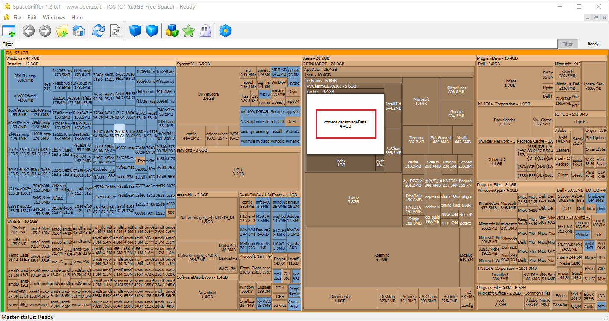
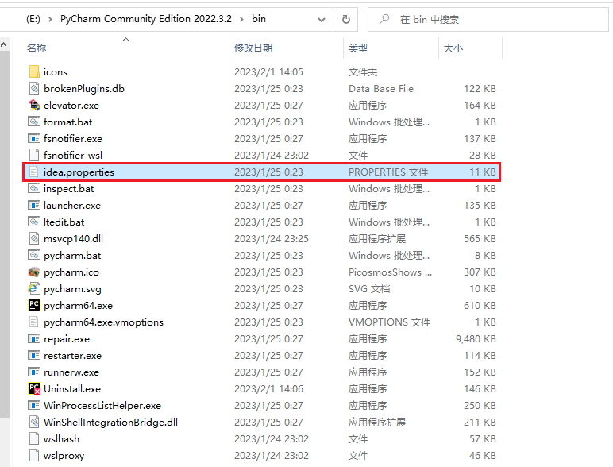
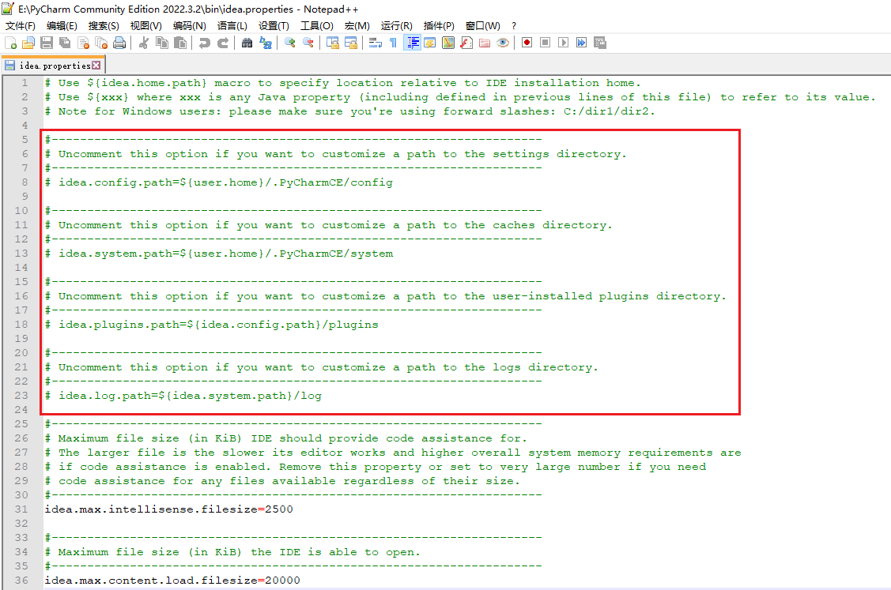
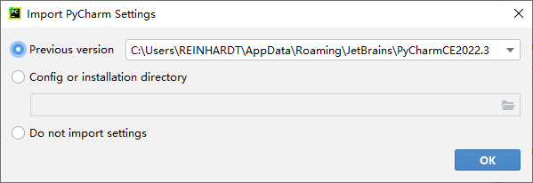

## 越来越小的C盘

最近C盘的空间越来越小了，于是便又开始找找有没有什么能删的垃圾文件。

推荐一个软件“SpaceSniffer”，它可以扫描分析每个盘里面各个文件所占的大小，我用他扫描了一下我的C盘结果看到用户目录下的PyCharm文件夹里有个文件“content.dat.storage.data”有4.4个G的大小。



网上一查是PyCharm的缓存文件，补充一下，该文件存放在Caches文件夹里，Cache一般就是指缓存文件夹，用来存缓存文件的，当时没反应过来，不过就算直到Cache放缓存文件可能也还是查一查确认一下放心。

这个缓存文件可以直接删除。但删除并不能从根源解决问题，因为下次使用PyCharm还是会生成缓存文件，早晚还是会一点一点挤占C盘的位置，所以最好的办法就是给PyCharm换一个缓存路径。

## 更换PyCharm缓存路径

找到PyCharm的安装目录下的bin文件夹，如`E:\PyCharm Community Edition 2022.3.2\bin`，找到其中的idea.properties文件



打开该文件，修改其中的四处位置，推荐用“NotePad++”打开。当然，记事本，VS Code之类的都可以。



上面红框就是我们要修改的部分，它注释掉的语句应该是它本来默认的存放路径，不过可能因为注释掉了，所以其实并没有存在这个路径中，但还是在C盘建了别的文件夹来放这些文件。我们将这些路径改为我们想让它存放的路径。我在PyCharm的安装目录下新建了一个".PyCharmCE2022.3"文件夹，并将这个路径改到了该文件夹下。

- 修改config路径

```bash
# idea.config.path=${user.home}/.PyCharmCE/config
idea.config.path=E:/PyCharm Community Edition 2022.3.2/.PyCharmCE2022.3/config
```

- 修改system路径

```bash
# idea.system.path=${user.home}/.PyCharmCE/system
idea.system.path=E:/PyCharm Community Edition 2022.3.2/.PyCharmCE2022.3/system
```

- 修改plugins路径

```bash
# idea.plugins.path=${idea.config.path}/plugins
idea.plugins.path=E:/PyCharm Community Edition 2022.3.2/.PyCharmCE2022.3/plugins
```

- 修改log路径

```bash
# idea.log.path=${idea.system.path}/log
idea.log.path=E:/PyCharm Community Edition 2022.3.2/.PyCharmCE2022.3/log
```

之后重启PyCharm，它会自动检测之前的配置所在位置，并提示导入之前的配置



点击ok就行了，然后就可以把之前C盘里的都删掉了。

不过因为前面提到的，它配置文件里那四个部分都默认是注释掉的，所以它实际存放的位置是在C盘别的位置，我的位置是在：

```
C:\Users\REINHARDT\AppData\Local\JetBrains\PyCharmCE2022.3
C:\Users\REINHARDT\AppData\Roaming\JetBrains\PyCharmCE2022.3
```

不过删完那个4.4G的缓存文件之后我看这两占内存也不是很大我就没删，以防之后发现上面的配置方法有问题，我好回来找。不过一般也没问题，咬咬牙删了也没事。
