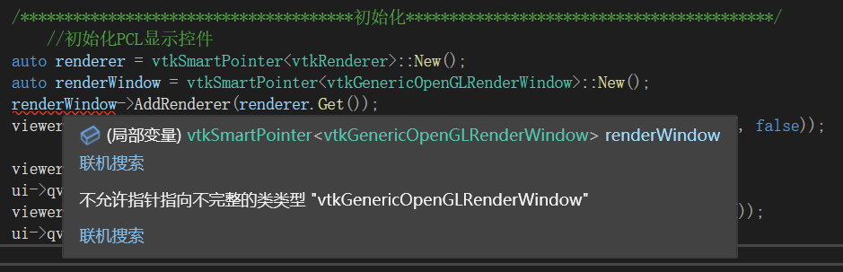

## QT+VTK+PCL显示点云

VTK9.0版本之后删除了**`QVTKWidget`**，VTK9.0版本之前，还是有用**`QVTKWidget`**写的代码，一般也是配合Qt5

VTK9.0版本之后，配合Qt6一般使用**`QVTKOpenGLNativeWidget`**

### QT5

这里是配合**`QVTKWidget`**的代码

**ui_mainwindow.h**

```C++
#include "qvtkwidget.h"
class Ui_MainWindow
{
public:
	...
	QVTKWidget *qvtkWidget;
	...
}
namespace Ui {
    class MainWindow: public Ui_MainWindow {};
}
```


**`mainwindow.h`**

```C++
#include "ui_mainwindow.h"
#include <boost/shared_ptr.hpp>
#include <pcl/visualization/pcl_visualizer.h>
class MainWindow : public QMainWindow
{
    Q_OBJECT
    
    ...
    
private:
    Ui::MainWindow *ui;
    boost::shared_ptr<pcl::visualization::PCLVisualizer> viewer;
    
	...
	
};
```


**`mainwindow.cpp`**

```C++
#include "mainwindow.h"
#include <vtkRenderWindow.h>

//初始化PCL显示控件
viewer.reset(new pcl::visualization::PCLVisualizer("viewer", false));
ui->qvtkWidget->SetRenderWindow(viewer->getRenderWindow());
viewer->setupInteractor(ui->qvtkWidget->GetInteractor(), ui->qvtkWidget->GetRenderWindow());
ui->qvtkWidget->update();
```


### QT6

这里是配合**`QVTKOpenGLNativeWidget`**的代码

**ui_mainwindow.h**

这里就是把`QVTKWidget`换成了`QVTKOpenGLNativeWidget`

```C++
#include "qvtkopenglnativewidget.h"

class Ui_MainWindow
{
public:
	...
	QVTKOpenGLNativeWidget *qvtkopenglnativewidget;
	...
}
namespace Ui {
    class MainWindow: public Ui_MainWindow {};
}
```

**`mainwindow.h`**

这里都是一样的

```C++
#include "ui_mainwindow.h"
#include <boost/shared_ptr.hpp>
#include <pcl/visualization/pcl_visualizer.h>
class MainWindow : public QMainWindow
{
    Q_OBJECT
    
    ...
    
private:
    Ui::MainWindow *ui;
    boost::shared_ptr<pcl::visualization::PCLVisualizer> viewer;
    
	...
	
};
```


**`mainwindow.cpp`**

主要区别在这里

区别于上面的版本，`render`和`renderwindow`需要初始化，保证不是空指针；

`qvtkwidget`用的`GetInteractor()`、`GetRenderWindow()`方法在`qvtkopenglnativewidget`中替换为了`interactor()`、`renderWindow()`方法

```C++
#include "mainwindow.h"
#include <vtkRenderWindow.h>
#include <vtkGenericOpenGLRenderWindow.h>

//初始化PCL显示控件
auto renderer = vtkSmartPointer<vtkRenderer>::New();
auto renderWindow = vtkSmartPointer<vtkGenericOpenGLRenderWindow>::New();
renderWindow->AddRenderer(renderer.Get());
viewer.reset(new pcl::visualization::PCLVisualizer(renderer, renderWindow, "viewer", false));

ui->qvtkopenglnativewidget->setRenderWindow(viewer->getRenderWindow());
viewer->setupInteractor(ui->qvtkopenglnativewidget->interactor(), ui->qvtkopenglnativewidget->renderWindow());
ui->qvtkopenglnativewidget->update();
```


#### PS：记录一个比较坑的点



在使用上面三句初始化的语句时，指着`renderWindow`报了个错，但实际上是因为`vtkGenericOpenGLRenderWindow`这个所需的头文件没有引入导致的，引入头文件`#include <vtkGenericOpenGLRenderWindow.h>`即可解决

不懂为什么它不提示`vtkGenericOpenGLRenderWindow`有问题，一般谁缺头文件就会提示谁有问题。

通过这个例子也记下来，提示指向不完整类类型”`xxx`“的时候，可能是缺了`xxx.h`的头文件，所以`xxx`才会定义不完整


### 关于对VTK+PCL显示点云的理解

需要用到vtk的显示化窗口QVTKOpenGLNativeWidget

又用到了pcl的PCLVisualizer

**其中PCL可视化类PCLVisualizer负责管理数据，QVTKWidget才是真正渲染数据的地方，类似于画布。**

所以，可视化类一定要设置渲染窗口，即最终要把数据显示在哪里。关键代码如下：

```C++
this->SetRenderWindow(_viewer->getRenderWindow());
```

有了可视化的容器，我们现在还不清楚到底怎么把数据刷到QVTKWidget上，刚才说过，PCL可视化器是管理数据的，所以，我们想显示谁就把谁添加到PCL可视化器上。

```C++
_viewer->addPointCloud(_cloud);
```


