# 随笔

## clicked()、triggered()、toggled()三个信号的区别

### toggled()

toggle 类似开关。 具有2个状态，打开/关闭。  使用这个信号，是在这2个状态之间切换。checkable按纽或是图标的槽函数应该用toggled()事件来激活

### triggered()

trigger是一次性的。 点击后，无法改变状态。 要么是打开，要么是关闭。一般的按纽（uncheckable）的激活方式即是triggered()。更有触发的意思。这个单词还有另一个意思就是板机

### clicked()

和triggered()用法一样，使用场景不同，triggered() 正常情况下应该广泛地多，比如快捷键等


## 信号与槽

### 信号 signals

信号的创建规则：

- 信号使用 signals 关键字声明，在其后面有一个冒号“:”，在其前面不能有 public、private、protected 访问控制符，信号默认是 public 的。


- 信号只需像函数那样声明即可，其中可以有参数，参数的主要作用是用于和槽的通信，这就像普通函数的参数传递规则一样。信号虽然像函数，但是对他的调用方式不一样，信号需要使用 emit 关键字发射。


- 信号只需声明，不能对其进行定义，信号是由 moc 自动生成的。


- 信号的返回值只能是 void 类型的。

### 槽 slots

槽的创建规则：

- 声明槽需要使用 slots 关键字，在其后面有一个冒号“:”，且槽需使用 public、private、protected 访问控制符之一。
- 槽就是一个普通的函数，可以像使用普通函数一样进行使用，槽与普通函数的主要区别是，槽可以与信号关联。


### 发射信号 emit

注意这里的"发射信号"指的是一个动作

发射信号的创建规则：

- 发射信号需要使用 emit 关键字，注意，在 emit 后面不需要冒号。

- emit 发射的信号使用的语法与调用普通函数相同，比如有一个信号为 void f(int)，则发送的语法为：emit f(3); 

- 当信号被发射时，与其相关联的槽函数会被调用(注意：信号和槽需要使用

- QObject::connect 函数进行关联之后，发射信号后才会调用相关联的槽函数。

- 因为信号位于类之中，因此发射信号的位置需要位于该类的成员函数中或该

- 类能见到信号的标识符的位置。

### 代码示例：

```c++
//头文件 m.h 的内容
class A : public QObject{ //信号和槽必须继承自 QObject 类
  Q_OBJECT                    //必须添加该宏
  
  //public signals:void s1(int);  //错误 signals 前不能有访问控制符。
  
  signals:void s();//使用 signals 关键字声明信号，信号的语法与声明函数相同。
  signals:void s(int,int);//正确，信号可以有参数，也可以重载。
  
  //void s2(){} //错误，信号只需声明，不能定义。
  
  void s3(); //注意：这仍是声明的一个信号
public://信号声明结束后，重新使用访问控制符，表示以下声明的是成员函数。
  void g(){
    emit s3(); //发射信号
  }
};
class B:public QObject{
  Q_OBJECT
public slots:               //使用 slots 关键字声明槽
  void x(){
    cout<<"X"<<endl;
  }
  //slots: void x(){}     //错误，声明槽时需要指定访问控制符。
  public:
  void g(){ 
    // emit s3();       //错误，在类 B 中对于标识符 s3 是不可见的
  }
};

//源文件的内容
int main(int argc, char *argv[]){
  A ma; 
  B mb;
  QObject::connect(&ma,&A::s3,&mb,&B::x); //关联信号和槽
  ma.g(); //调用g发送信号
  return 0;
}
```


# Qt Designer使用

## 菜单栏、工具栏的创建

创建新项目时，其实已经帮我们默认创建好菜单栏、工具栏和状态栏了。菜单栏在窗口顶部，可以看到“在这里输入”的提示，那一栏就是菜单栏的位置，其对象名为menuBar，可以在右侧对象检查器中看到，菜单栏只能有一个。工具栏在菜单栏下面紧挨着，初始也帮我们建了一个，对象名为mainToolBar，工具栏可以有多个，想创建的话，在主对象上右键->创建工具栏即可。状态栏我不知道在哪，不过这东西也只能有一个，且初始帮我们创建了，对象名为statusBar。

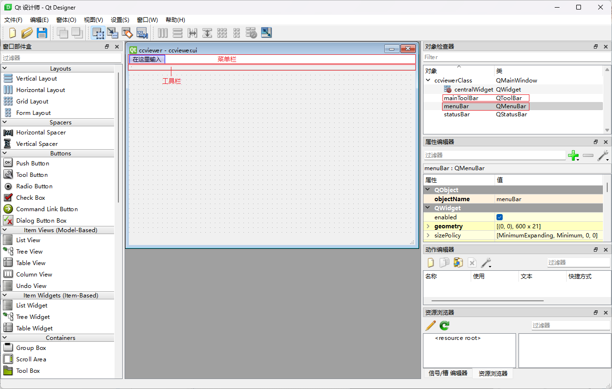

在主对象上右键->添加工具栏以添加新的工具栏，状态栏因为已经有了所以这里显示"移除状态栏"，菜单栏也因为已经有了直接不显示，若初始没有菜单栏，这里右键就能看到“创建菜单栏”的选项。


在菜单栏的“在这里输入”中输入具体的内容，如option。这时右侧menuBar下会多一栏menuoption，而且点击菜单栏的option，该栏会展开，一开始也是只有“在这里输入”和“添加分隔符”两项内容，在里面输入具体内容之后就相当于给它们创建了实体，如这里我输入了option1和option2，这种就算是具体的动作了，创建这两个的同时，不光右侧对象检查器的menuoption栏下会多两个QAction：actionoption1和actionoption2，动作编辑器中也会多出两项：actionoption1和actionoption2。另外，option1右侧可以看到蓝色的小加号，点击之后可以将option1再展开，通过“在这里输入”输入具体的名称，继续添加具体的项。

之后将具体的对象与槽函数连接来实现具体功能即可。

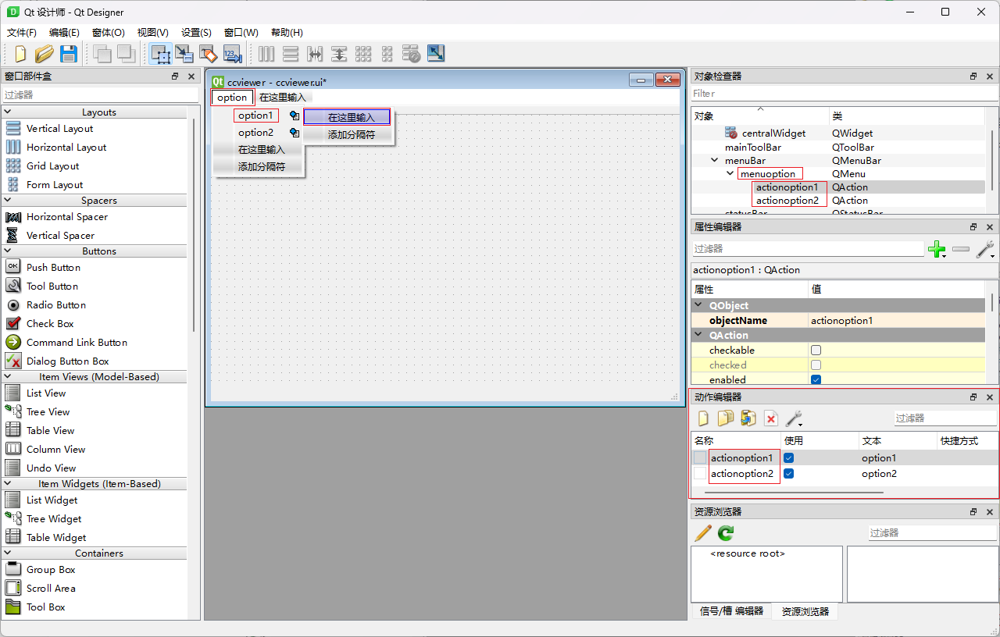


# Qt+VS多窗口程序

## 新建ui及配套.h与.cpp文件

想创建新的ui，并自动创建配套的.h和.cpp文件时，选择新建Qt Widgets Class 这一项

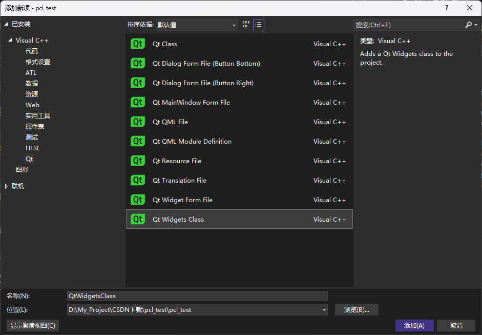

然后就会弹出Qt的创建Widgets类的窗口，根据自己的需要自定义name，选择新窗口要继承的基类，即可生成 xx.ui ，xx.h  ，xx.cpp三件套

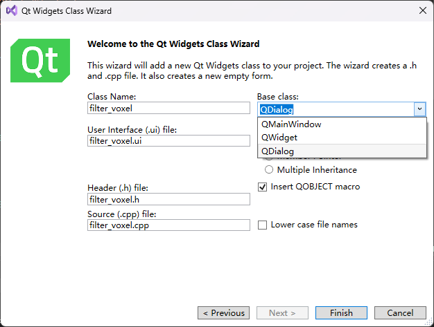

顺便提一嘴，添加新项的时候，选第一个“Qt Class”，会创建一个Qt类，包含xx.h 和 xx.cpp，下面看看它xx.h和xx.cpp中的内容：

**`QtClass.h`：**

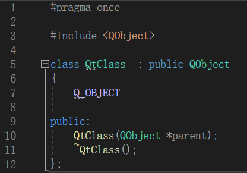

**`QtClass.cpp`：**

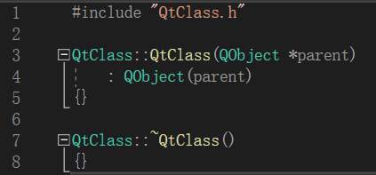

相比创建Qt Widget Class 来，就少了个ui界面文件，想用纯代码风格编程，来键窗口之类的，创建这种Qt Class就行

***

然后创建新项那一栏再往下：

下面“Qt Dialog From File”是只单独创建xx.ui一个文件，没有配套的xx.h和xx.cpp文件生成的

再往下的一些选项是创建xx.qml，xx.qrc之类的，具体的创建新项的时候去看右边的说明吧


## 主窗口调用新建的窗口

### 新建窗口的内容

先看一眼刚刚新建的窗口头文件与源文件，看看它们如何与ui文件联系起来的

**`filter_voxel.h`**

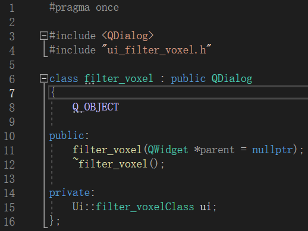

主要还是靠自动配置好的`#include"Ui_filter_voxel.h"`配合起来的

**`filter_voxel.cpp`**

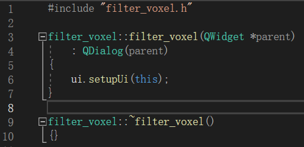

之后有什么要让这个窗口实现的内容就在这个窗口来做就行。添加组件、添加信号、添加槽函数。。。

### 主窗口的内容

现在来看如何让主窗口和新建的窗口联系起来

**主窗口头文件`mainwindow.h`**

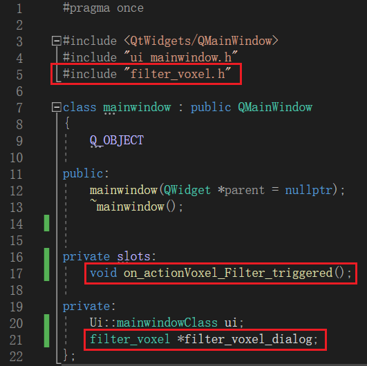

一是引入新建窗口的头文件`#include “filter_voxel.h”`

二是在成员中声明新建窗口类`filter_voxel *filter_voxel_dialog`

三就是创建一个槽函数`void on_actionVoxel_Filter_triggered()`，一会用来产生与新建窗口相关的响应

**PS：**其中关于第二条，声明新建窗口类时，这里声明的是个指针，而注意到上面`ui`声明的是个非指针的对象。在开源项目CloudCompare，以及看别人写的项目中，包含`ui`在内的，这些窗口相关的对象的声明都是声明成**指针**类型，所以我这里也声明成指针类型。而上面这个`ui`是创建项目时自定义生成的，它就没声明成指针类型，然后我就没搞明白为什么会这样，那些开源项目里的指针类型的`ui`都是他们后来自己改的吗？指针类型相较非指针类型有哪些好处吗？那这个初始创建的时候它为什么是默认生成的非指针类型啊？


**主窗口源文件`mainwindow.cpp`**

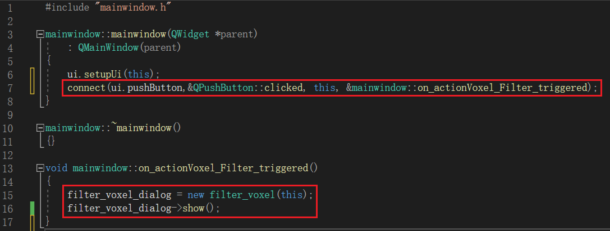

在源文件中一是把槽函数进行实现，这里对`filter_voxel`新窗口类进行初始化，并调用`show()`函数进行窗口的显示

二是将具体的信号与槽函数进行连接，这里是将主窗口的一个按钮`pushButton`与刚才实现的槽函数进行连接，这样点击主窗口的按钮时，就会执行槽函数的命令，创建`filter_voxel`窗口并显示

效果如下：

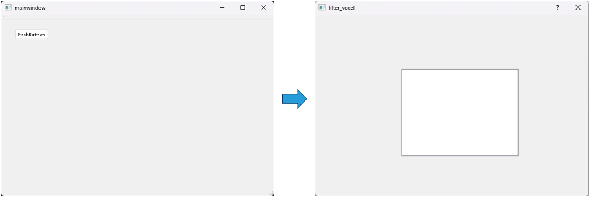

### 关于connect的写法

上面用到的connect的写法：

```C++
connect(ui.pushButton,&QPushButton::clicked, this, &mainwindow::on_actionVoxel_Filter_triggered);
```

这种写法使用了 C++11 引入的新的信号和槽语法。它通过使用成员函数指针来连接信号和槽。在这个例子中，`ui.pushButton` 是一个 `QPushButton` 对象，`clicked` 是 `QPushButton` 类的一个信号，`this` 是当前对象（通常是一个派生自 `QObject` 的类的实例），`on_actionVoxel_Filter_triggered` 是一个槽函数。

这种语法有一些优点，包括静态类型检查、更好的编译时错误检测和自动的函数重载解析。它是推荐的写法，尤其是在使用 C++11 或更高版本的编译器时。

***

然后还有这样一种写法：

```C++
connect(ui.pushButton, SIGNAL(triggered()), this, SLOT(on_actionVoxel_Filter_triggered()));
```

这种写法使用了旧版本的信号和槽语法，称为字符串连接。在这种语法中，`SIGNAL` 和 `SLOT` 是宏，它们将信号和槽函数的名称作为字符串传递给 `connect` 函数。

这种语法在较早的 Qt 版本中广泛使用，但在较新的 Qt 版本中已经被废弃。它的缺点是不进行静态类型检查，容易出现拼写错误或函数重载引起的问题。因此，建议使用第一种 C++11 引入的语法，以获得更好的类型安全性和编译时错误检查。

***

**总结：**以后连接信号与槽函数都使用第一种写法，第二种旧版的写法应该是已经弃用了，虽然不会报错，但写了完全没有起到作用，信号与槽完全没有连接起来

## 窗口之间相互传递数据

就以新建的窗口向主窗口传递数据为例：

**`filter_voxel.h`**

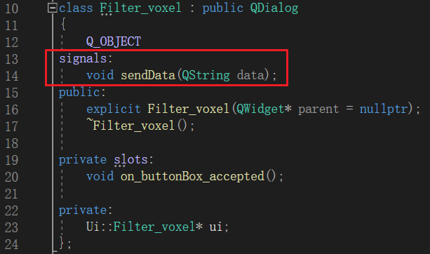

自定义信号`sendData(QString data)`，其中函数的参数列表，这里是一个`QString`，即是到时要传递的参数的数量和类型，这里可以知道到时只传递一个`QString`类型的数据

像下面这种，就是到时要传递四个`QString`类型的数据

```C++
signals:
    void sendData(QString data1, QString data2, QString data3, QString data4);
```


**`filter_voxel.cpp`**

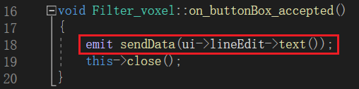

当按钮被按下的时候使用`emit`触发自定义的信号，并将要传递的数据赋给形参，`ui->lineEdit-text()`即是将新窗口`lineEdit`中的文本传递给了之前自定义的形参`QString data`

如果有多个参数要传，就都一一对应地写明：

```C++
emit sendData(ui->lineEdit->text(), ui->lineEdit_2->text(), ui->lineEdit_3->text(), ui->lineEdit_4->text());
```


**`mainwindow.cpp`**

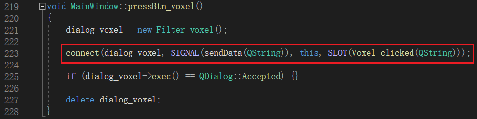

使用`connect`将信号与槽函数连接，信号的形参列表里的参数就传给了槽函数

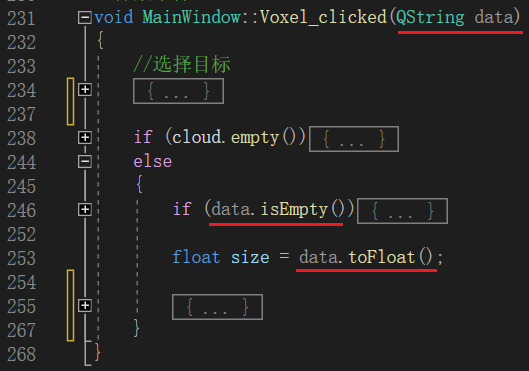

参数传给槽函数，槽函数就正常用就行

***

信号的参数数量与连接的槽函数的参数数量一致：

```C++
connect(dialog_icp, SIGNAL(sendData(QString, QString, QString, QString)),
        this, SLOT(Icp_clicked(QString, QString, QString, QString)));
```

```C++
void MainWindow::Icp_clicked(QString data1, QString data2, QString data3, QString data4){...}
```


# Qt多线程
