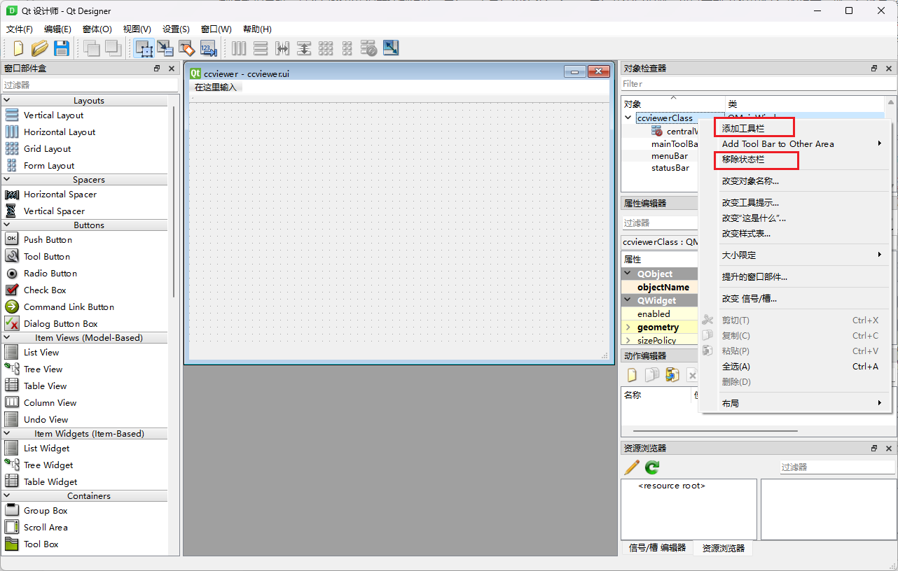
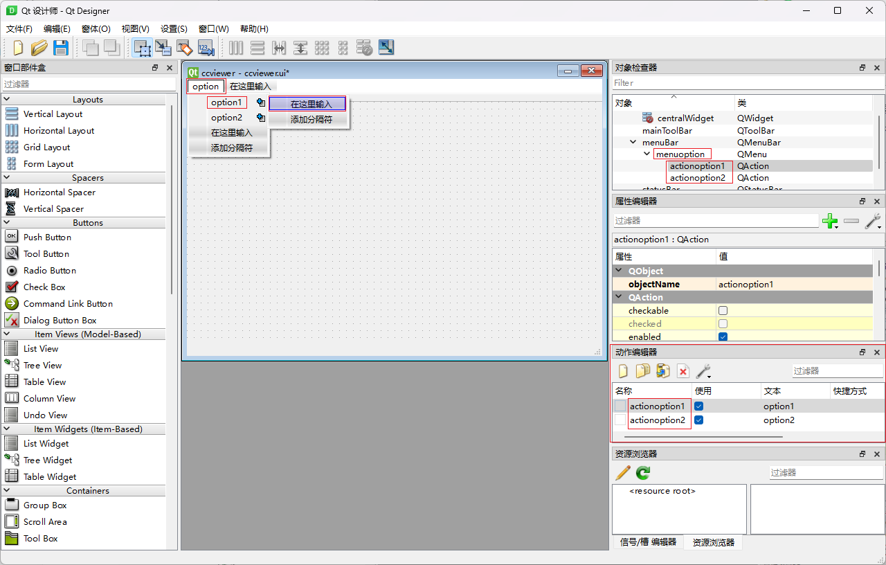

# 随笔

## clicked()、triggered()、toggled()三个信号的区别

### toggled()

toggle 类似开关。 具有2个状态，打开/关闭。  使用这个信号，是在这2个状态之间切换。checkable按纽或是图标的槽函数应该用toggled()事件来激活

### triggered()

trigger是一次性的。 点击后，无法改变状态。 要么是打开，要么是关闭。一般的按纽（uncheckable）的激活方式即是triggered()。更有触发的意思。这个单词还有另一个意思就是板机

### clicked()

和triggered()用法一样，使用场景不同，triggered() 正常情况下应该广泛地多，比如快捷键等


## 信号与槽

### 信号 signals

信号的创建规则：

- 信号使用 signals 关键字声明，在其后面有一个冒号“:”，在其前面不能有 public、private、protected 访问控制符，信号默认是 public 的。


- 信号只需像函数那样声明即可，其中可以有参数，参数的主要作用是用于和槽的通信，这就像普通函数的参数传递规则一样。信号虽然像函数，但是对他的调用方式不一样，信号需要使用 emit 关键字发射。


- 信号只需声明，不能对其进行定义，信号是由 moc 自动生成的。


- 信号的返回值只能是 void 类型的。

### 槽 slots

槽的创建规则：

- 声明槽需要使用 slots 关键字，在其后面有一个冒号“:”，且槽需使用 public、private、protected 访问控制符之一。
- 槽就是一个普通的函数，可以像使用普通函数一样进行使用，槽与普通函数的主要区别是，槽可以与信号关联。


### 发射信号 emit

注意这里的"发射信号"指的是一个动作

发射信号的创建规则：

- 发射信号需要使用 emit 关键字，注意，在 emit 后面不需要冒号。

- emit 发射的信号使用的语法与调用普通函数相同，比如有一个信号为 void f(int)，则发送的语法为：emit f(3); 

- 当信号被发射时，与其相关联的槽函数会被调用(注意：信号和槽需要使用

- QObject::connect 函数进行关联之后，发射信号后才会调用相关联的槽函数。

- 因为信号位于类之中，因此发射信号的位置需要位于该类的成员函数中或该

- 类能见到信号的标识符的位置。

### 代码示例：

```c++
//头文件 m.h 的内容
class A : public QObject{ //信号和槽必须继承自 QObject 类
  Q_OBJECT                    //必须添加该宏
  
  //public signals:void s1(int);  //错误 signals 前不能有访问控制符。
  
  signals:void s();//使用 signals 关键字声明信号，信号的语法与声明函数相同。
  signals:void s(int,int);//正确，信号可以有参数，也可以重载。
  
  //void s2(){} //错误，信号只需声明，不能定义。
  
  void s3(); //注意：这仍是声明的一个信号
public://信号声明结束后，重新使用访问控制符，表示以下声明的是成员函数。
  void g(){
    emit s3(); //发射信号
  }
};
class B:public QObject{
  Q_OBJECT
public slots:               //使用 slots 关键字声明槽
  void x(){
    cout<<"X"<<endl;
  }
  //slots: void x(){}     //错误，声明槽时需要指定访问控制符。
  public:
  void g(){ 
    // emit s3();       //错误，在类 B 中对于标识符 s3 是不可见的
  }
};

//源文件的内容
int main(int argc, char *argv[]){
  A ma; 
  B mb;
  QObject::connect(&ma,&A::s3,&mb,&B::x); //关联信号和槽
  ma.g(); //调用g发送信号
  return 0;
}
```


# Qt Designer使用

## 菜单栏、工具栏的创建

创建新项目时，其实已经帮我们默认创建好菜单栏、工具栏和状态栏了。菜单栏在窗口顶部，可以看到“在这里输入”的提示，那一栏就是菜单栏的位置，其对象名为menuBar，可以在右侧对象检查器中看到，菜单栏只能有一个。工具栏在菜单栏下面紧挨着，初始也帮我们建了一个，对象名为mainToolBar，工具栏可以有多个，想创建的话，在主对象上右键->创建工具栏即可。状态栏我不知道在哪，不过这东西也只能有一个，且初始帮我们创建了，对象名为statusBar。


在主对象上右键->添加工具栏以添加新的工具栏，状态栏因为已经有了所以这里显示"移除状态栏"，菜单栏也因为已经有了直接不显示，若初始没有菜单栏，这里右键就能看到“创建菜单栏”的选项。



在菜单栏的“在这里输入”中输入具体的内容，如option。这时右侧menuBar下会多一栏menuoption，而且点击菜单栏的option，该栏会展开，一开始也是只有“在这里输入”和“添加分隔符”两项内容，在里面输入具体内容之后就相当于给它们创建了实体，如这里我输入了option1和option2，这种就算是具体的动作了，创建这两个的同时，不光右侧对象检查器的menuoption栏下会多两个QAction：actionoption1和actionoption2，动作编辑器中也会多出两项：actionoption1和actionoption2。另外，option1右侧可以看到蓝色的小加号，点击之后可以将option1再展开，通过“在这里输入”输入具体的名称，继续添加具体的项。

之后将具体的对象与槽函数连接来实现具体功能即可。


