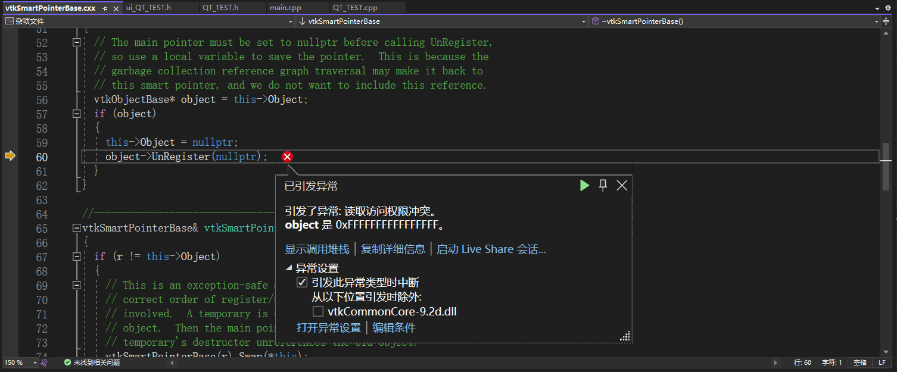
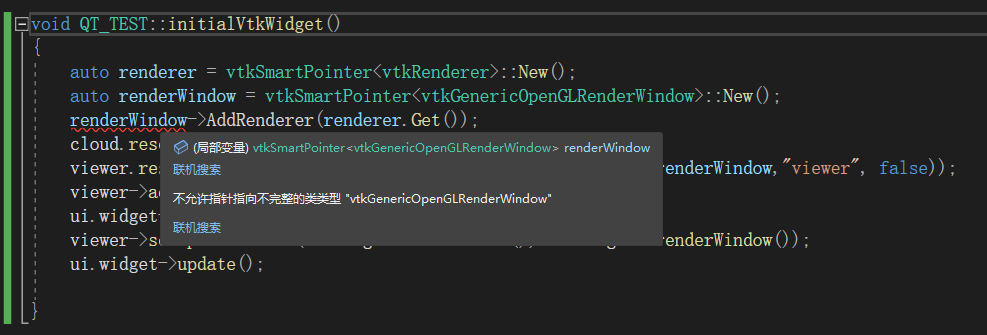
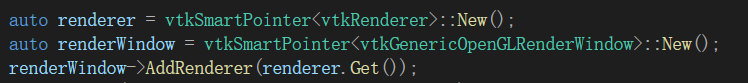
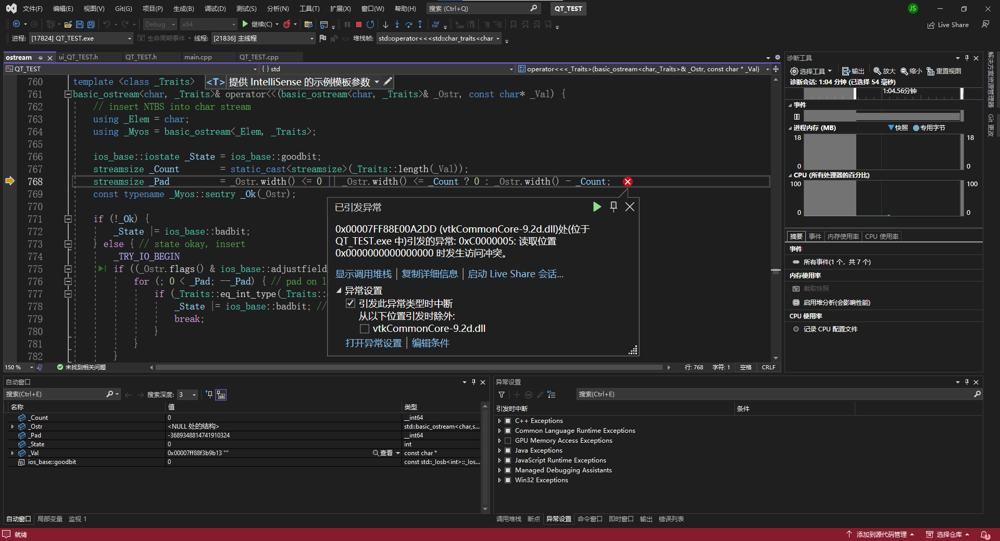

## 问题描述

一开始因为PCL自带一个VTK9.1环境，因为要VTK和Qt配合，去官网下了完整VTK9.2自己编译了一下，然后又在Qt项目里配了一下VTK的环境，估计是他先找到了PCL自带的VTK9.1环境，就没管我自己配的VTK9.2，导致报了个“未定义标识符VTK_UNICODE_STRING”的错


考虑到两个VTK环境冲突的问题，就把PCL自带的那个VTK9.1的环境配置都删了一遍，结果又出现了下面的问题



看到这个dll想到可能是因为环境变量里PCL自带的VTK9.1和自己编译的VTK9.2冲突了，忘记改了，因为程序寻找dll文件是从环境变量PATH中从头到尾在找，当找到一个对应的目录的时候它就认定在这个目录里寻找dll文件了，而不会再往下找了，应该就是因为我把PCL自带的VTK9.1的bin路径放在了自己编译的VTK9.2的bin路径之前导致的问题


结果一看不对啊，自己编译的VTK9.2的bin路径是在上面的呀，惊了。。。

然后我又试了试直接把PCL自带的VTK9.1的bin路径删掉，结果程序报错找不到vtk9.1d的dll了，说明程序哪里还用着pcl自带的vtk9.1 。。。


话说pcl自带的vtk9.1有QVTKOpenGLNativeWidget吗，有的话我直接用PCL自带vtk9.1算了。。。

去看了一下没有，然后想起来了，这个模块是要编译VTK的时候选一下配合Qt才会生成，乐，还是要用自己配的。。。


可能是PCL一些东西配合自带的VTK才能实现，明天试试把自己编译的VTK覆盖PCL自带的VTK试一下。。。记得做好备份

实在不行就得把PCL编译需要的东西都下一遍，然后用CMake从头编译一下来弄了。。。


第二天继续试，把VTK覆盖试了试好像不行

然后开始调试，看看是哪个语句的问题，发现是初始化语句的问题，因为初始化用的是qvtkwidget版本时的代码，所以可能有些问题，于是就去找了QVTKOpenGLNativeWidget版本显示点云数据的代码

结果照着别人的代码敲还是有问题



找了找资料发现出现这种问题一般是因为这个类没有定义，其实就是vtkGenericOpenGLRenderWindow这个类的头文件没有引入，这里不得不吐槽一下，既然头文件没引入，你上面的的没啥不报错啊。。。

引入头文件：

```C++
#include <vtkGenericOpenGLRenderWindow.h>
```

之后该语句就不会报错了



以为终于没问题的时候，在执行到语句

```C++
viewer.reset(new pcl::visualization::PCLVisualizer(renderer,renderWindow,"viewer", false));
```

的时候还是报错了。



估计还是因为弄了两个vtk导致的，可能pcl1.12和自己配的这个vtk9.2不太搭，网上查了查资料，也都是自己下一个vtk9.1自己编译一下，然后覆盖原来的pcl自带的vtkk，然后再编译PCL。

这次就老实照[这个](https://blog.csdn.net/qq_40732350/article/details/125394920)来一遍，他跟我想的一样，除了vtk自己编译，其他直接用pcl自带的编译好的就行，省事。

等开完会试一下。。。

## 解决

经过一番尝试，我已经完全理解了。

正确的做法就是用自己编译的vtk替代pcl自带的vtk，然后从官网下载pcl源码，然后重新编译pcl，让它和自己编译的vtk配合起来。这样既有了自己编译的vtk的Qt相关插件，又可以让pcl跟自己配的vtk适配，正常用pcl库。

具体的步骤见“PCL1.12.1+VS2022+Qt6.4 配置”中第二部分”PCL+VS+QT配置“

## 分析复盘

要使用Qt+PCL显示点云，需要用到VTK来控制Qt窗口组件来显示。而PCL自带的vtk是不含与Qt配合相关的文件的。于是，我就想着去vtk官网下一个vtk自己用cmake编译一下，选上qt6组件。也成功编译了，问题就在，我以为就是用一下这个组件，就给项目既配了PCL（自带vtk9.1）环境，又配了自己编译的vtk9.2环境，而这两个都有的情况下，编译器编译的时候会有各种冲突，除非你能精准挑出来pcl用的vtk9.1的哪部分，Qt用的vtk9.2的哪部分，然后只把这些用到的引入，其他无关的全部不要引到环境里，其实就算这样pcl和qt用的vtk的部分也可能重合，比如pcl要用9.1的vtkcommon.dll而qt要用9.2的vtkcommon.dll，所以还是不行，这样肯定冲突。

然后你又不能直接把pcl中vtk9.1的部分直接删掉或者替换成vtk9.2的，因为这个pcl是官网提供的编译好的，它是按照vtk9.1来编译的，对这个vtk9.1肯定又依赖。

所以，只有按上面解决办法来才是正解。而且顺便还可以配一下GPU模块。
