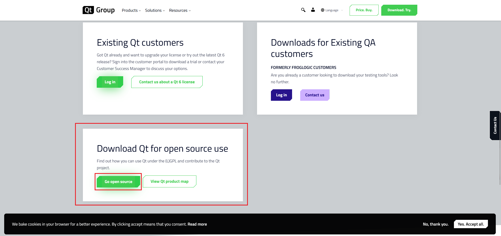
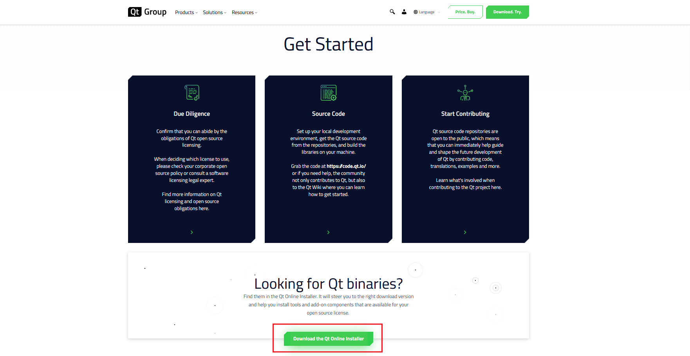
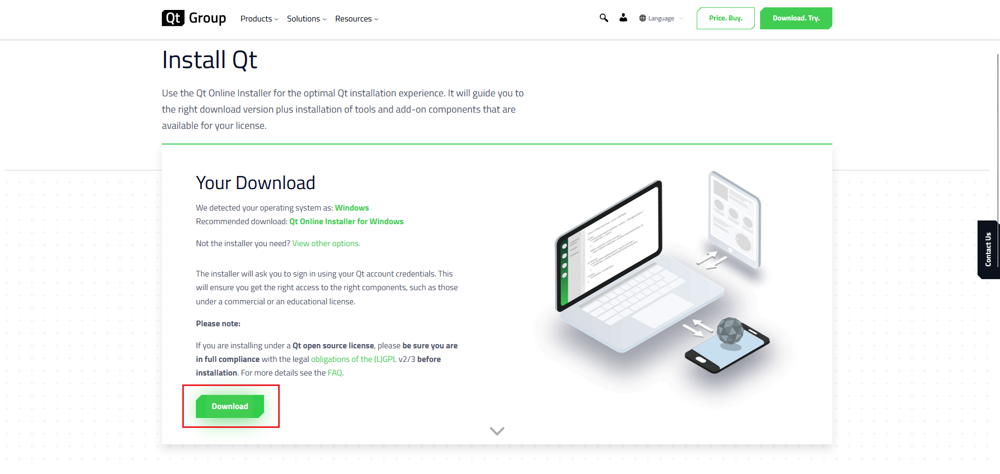
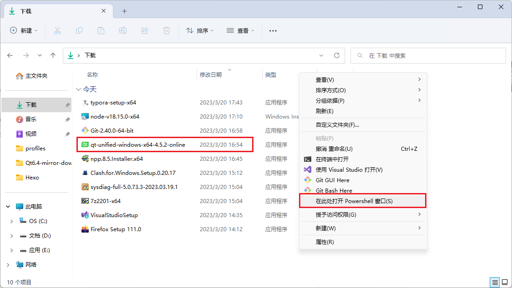
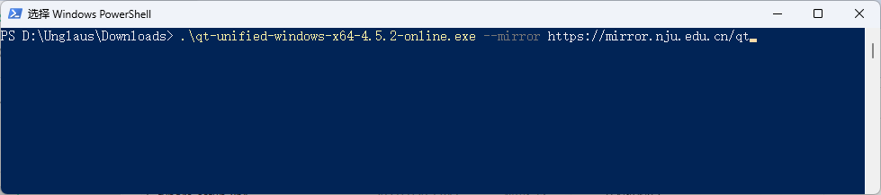
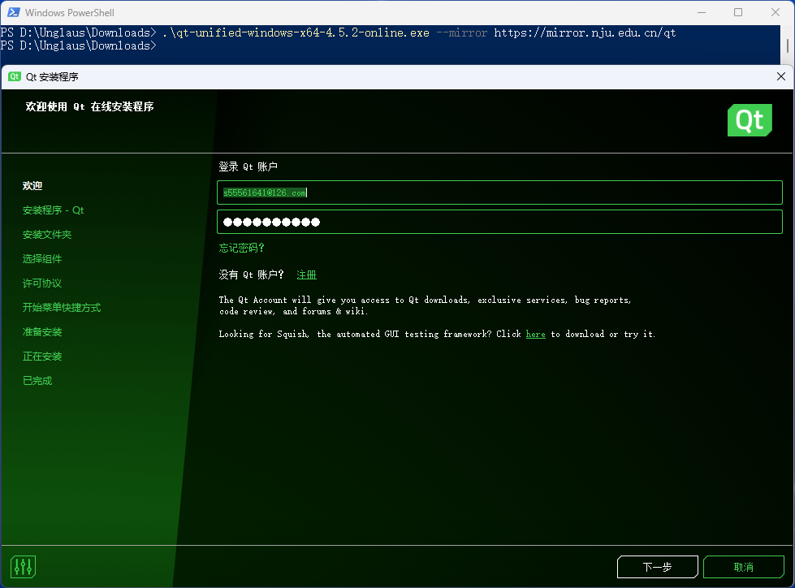
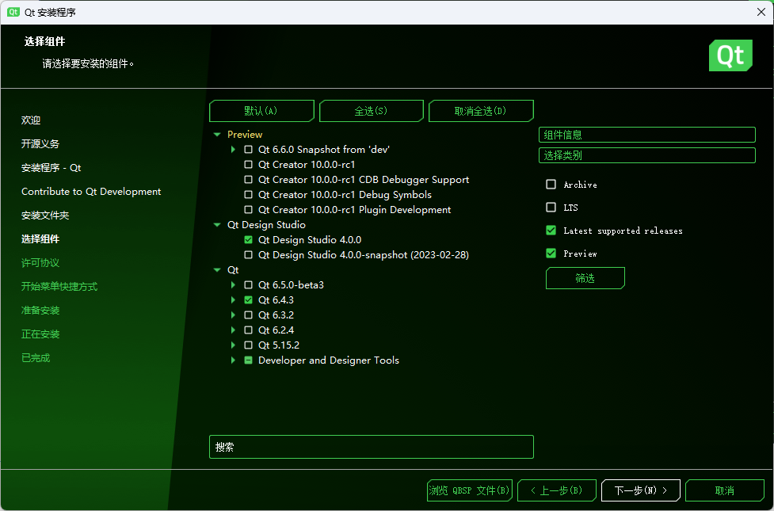
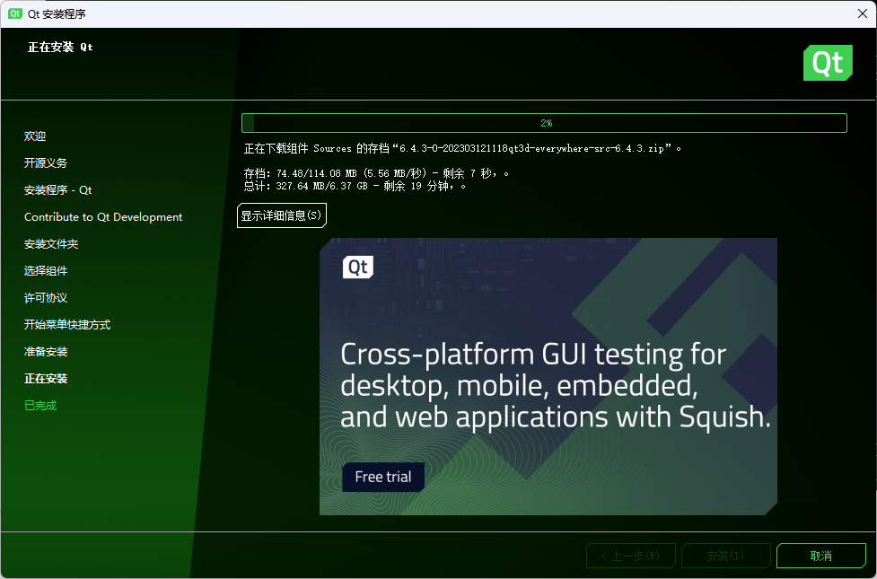
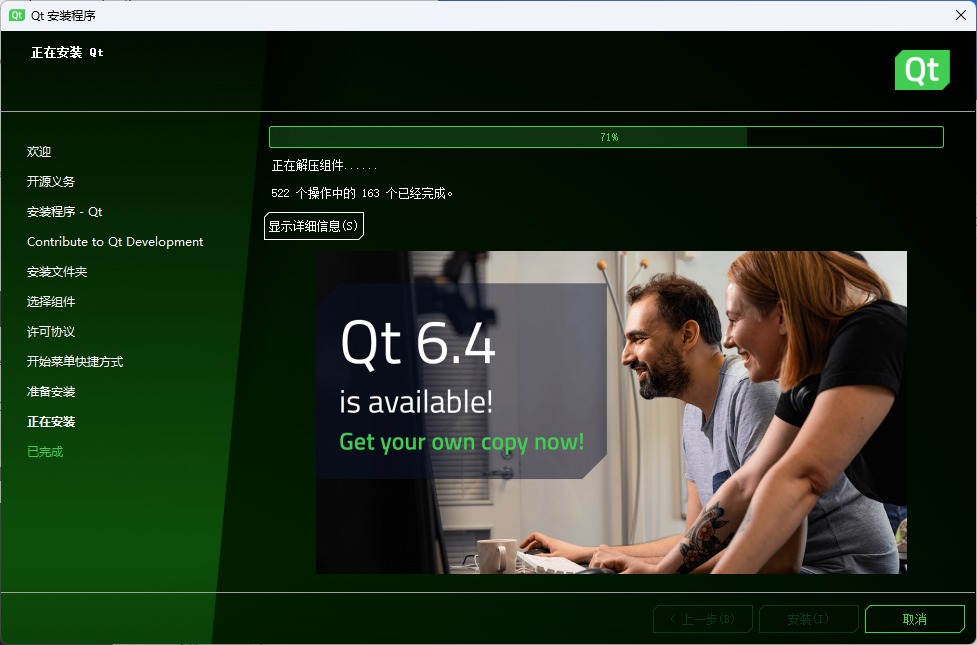

## 23-5-15更新

Qt6直接商业化，在线安装包直接变成商业Qt安装包，而且也不再提供Qt5安装了，只提供qt5.15.2的静态资源包。。。或者Qt5.12.12的离线安装包。

-----------------------------------------------------------------------------------------------分界线---------------------------------------------------------------------------------------------------------------------

最近在新电脑上重新装Qt6.4，学校的网不太行，安装时总是报错，干脆找了找教程，使用Qt官方的在线安装包配合国内镜像源来安装，这里记录一下。

## Qt在线安装包下载

他官网的安装包找起来绕过来绕过去，这里正好记录一下。

打开Qt官网 https://www.qt.io/ ，找到右上角的 ”Download.Try.“ 点击进入

进入的新页面拉到最底，找到"Download Qt for open source use"部分，点击"Go open source"进入下一个界面

在进入的新页面再往下滑，也是快划到底的地方有个"Download the Qt Online Installer" ，点击这个按钮

本来以为这就开始下载在线安装包了，结果还是进入新页面，点击新页面的这个"Download"，就真的开始下载在线安装包了

服了，下个在线安装包点了4个download，还都不重样，牛。

## 配置国内镜像源

直接使用这个在线安装包的话，因为资源服务器在国外，难免网不行导致安装时出错，干脆直接配置国内镜像源来安装。

找到Qt在线安装的存放路径，在空白处“shift+右键”，选择“打开Powershell窗口”

输入命令`.\qt-unified-windows-x64-4.5.2-online.exe --mirror https://mirror.nju.edu.cn/qt`，注意该命令前半部分，是自己下载的qt在线安装包的名字，可能不一样，根据自己的情况改一改。

输完之后回车，会不带任何提示地打开该安装包

之后就是正常的qt安装过程了，根据自己的需求选就行

之后就看各自的网速了

资源下载完之后就开始解压缩，等进度条100%，qt就算是安好了

