在安装Qt时，一般会自动安装配套的编译器Qt Creator，并为其自动配置好对应的Qt版本。比如当时安装Qt6.4时，自动安的Qt Creator 9，并为Qt6.4自动配置好了开发环境。

之后又安装了Qt5.15的版本，又给安装了一个Qt Creator 4，把Qt5.15的开发环境配置在里面，每次打开Qt5项目的时候都是自动用Qt Creator 4打开的

但其实完全没必要，Qt Creator就是个编译器，就用新版的就行，只不过是需要自己手动配置一下需要的Qt版本的开发环境罢了

下面举例说明

## 正文

打开Qt Creator，找到编辑-->Preferences

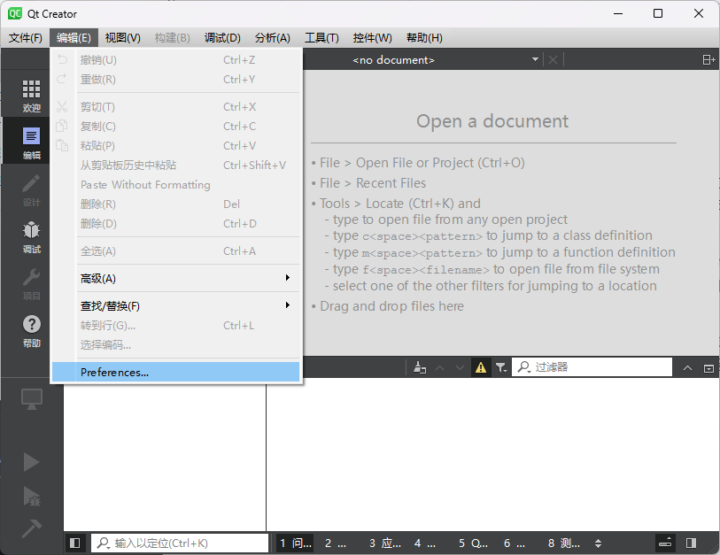

找到 构建套件(kit)

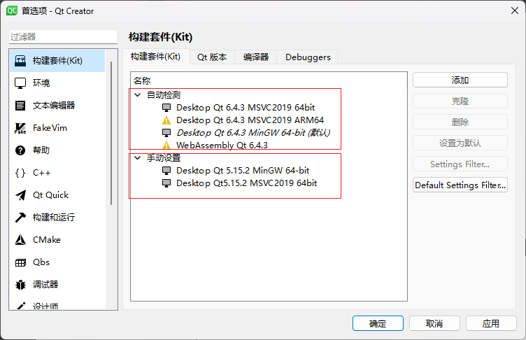

可以看到已经自动配置好了当时配套安装的Qt6.4的环境（自动检测）

自己之后安装的其他版本的Qt就需要自己手动设置了，如下面手动设置的Qt5.15

这样其实当时安装其他版本Qt的时候就不需要勾选Qt Creator选项了

### 配置编译器

在上图构建套件窗口选择-->编译器

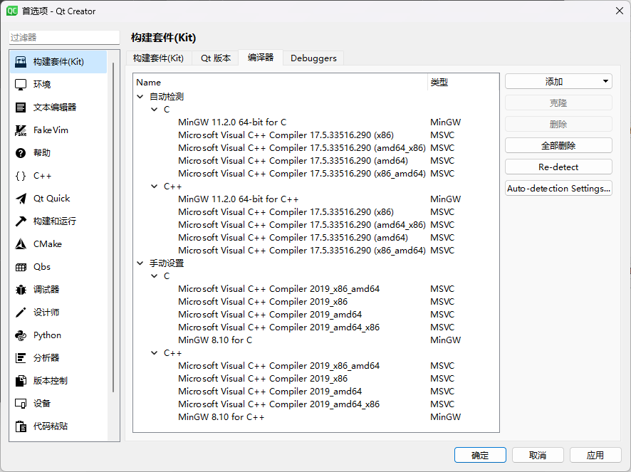

上图中"手动设置"部分就是我们需要配的，图中是已经配置好的效果

一般就配置两种编译器环境，一种MSVC，一种MinGW

然后每一种都把C、C++版本都配了就行

#### MinGW

MinGW是Qt最原生的编译器，所以配起来也简单，可以看到MinGW的编译器C和C++都只配了一个，而MSVC的C和C++每个配了四个

##### C

先配C吧，点击右上角"添加"，选MinGW-->C

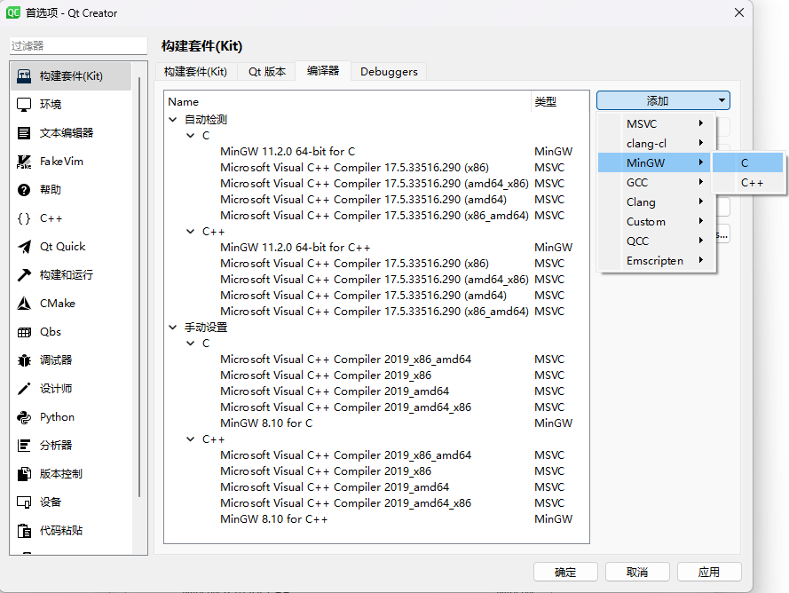

之后可以看到这个界面

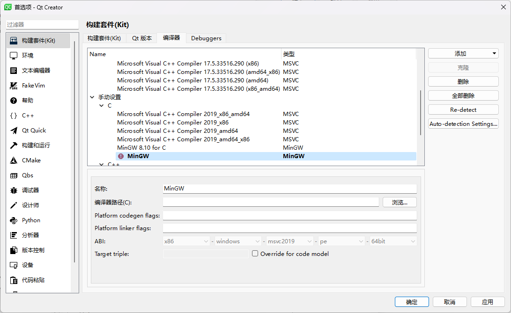

我们参考上面自动检测到的MinGW For C的配置

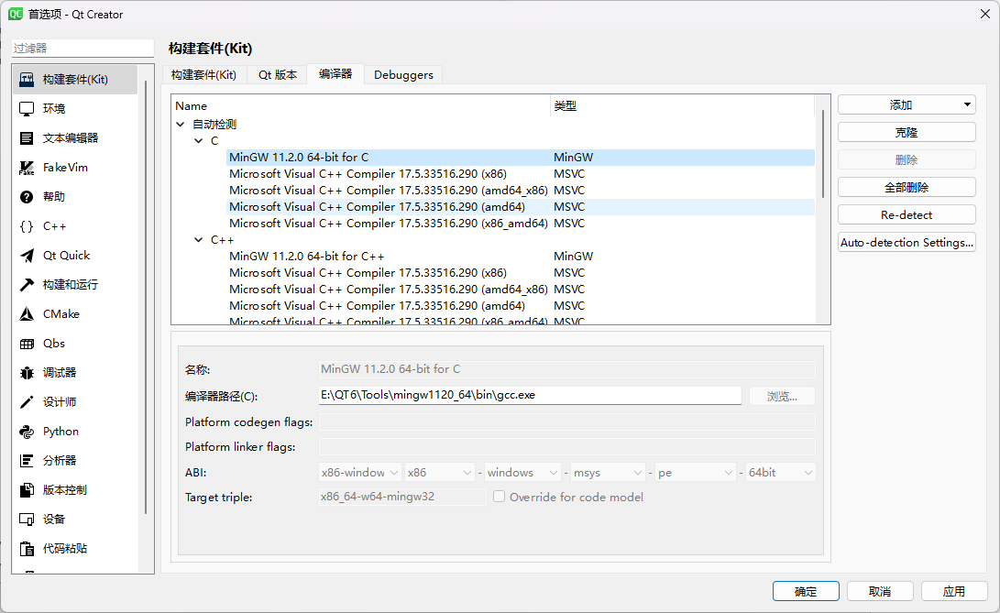

找到Qt5的gcc.exe路径，设置好即可，名称也参照着改了一下，这样就行了

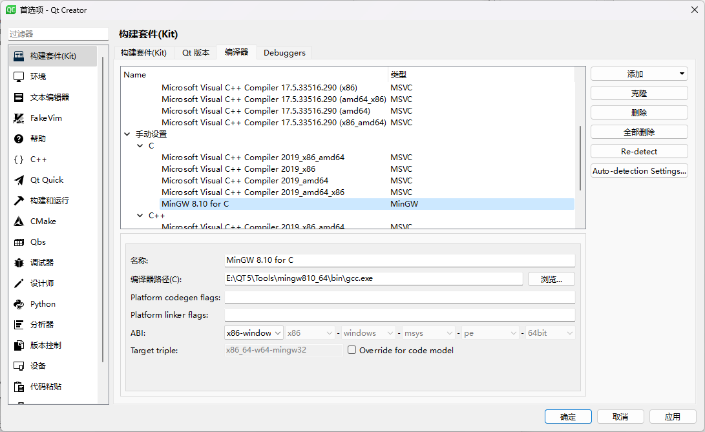

##### C++

然后配置C++版本的也是同理，先添加-->MinGW-->C++

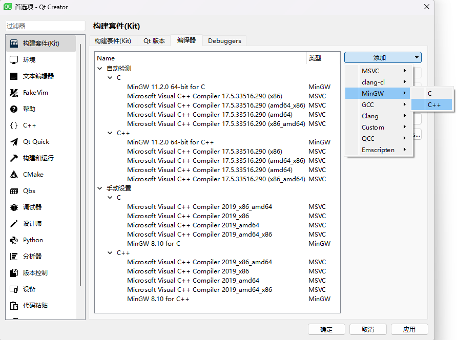

然后配置好编译器路径即可，不过C++用的是g++.exe，就这点区别

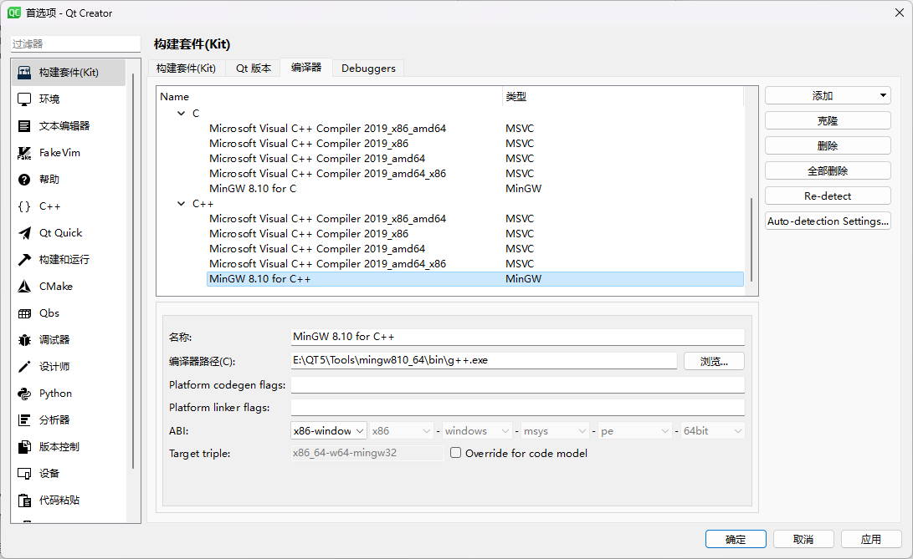

#### MSVC

MSVC稍微麻烦点，其实也不用C、C++每个配四个，不过因为对标上面自动检测出来的配置，所以就每个配了四个

##### C/C++

跟前面一样，要添加什么就选什么

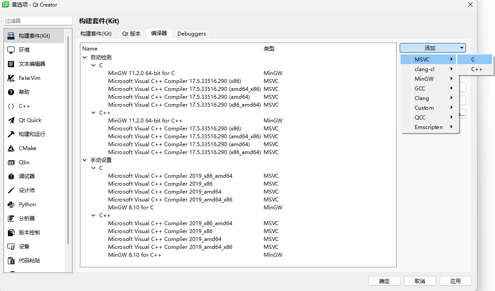

不过跟MinGW不同的是，MSVC中C\C++配置的路径都指向同一个东西，都是vcvarsall.bat

至于这个东西位置在哪，用"everything"来找就行

根据我的安装路径，找到`vcvarsall.bat`在`E:\Microsoft Visual Studio 2022\Community\VC\Auxiliary\Build\vcvarsall.bat`

然后参照着上面自动检测到的配置来配就行，这里给出每一种具体的配置，到时候自己来调就行

C和C++的除了到时候自己起的名称不一样，其他所有的东西都一样，这里就以C++为例展示了

- **Microsoft Visual C++ Compiler 2019_x86_amd64**

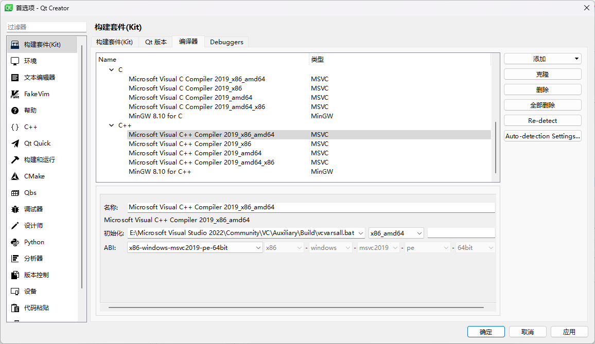

- **Microsoft Visual C++ Compiler 2019_x86**

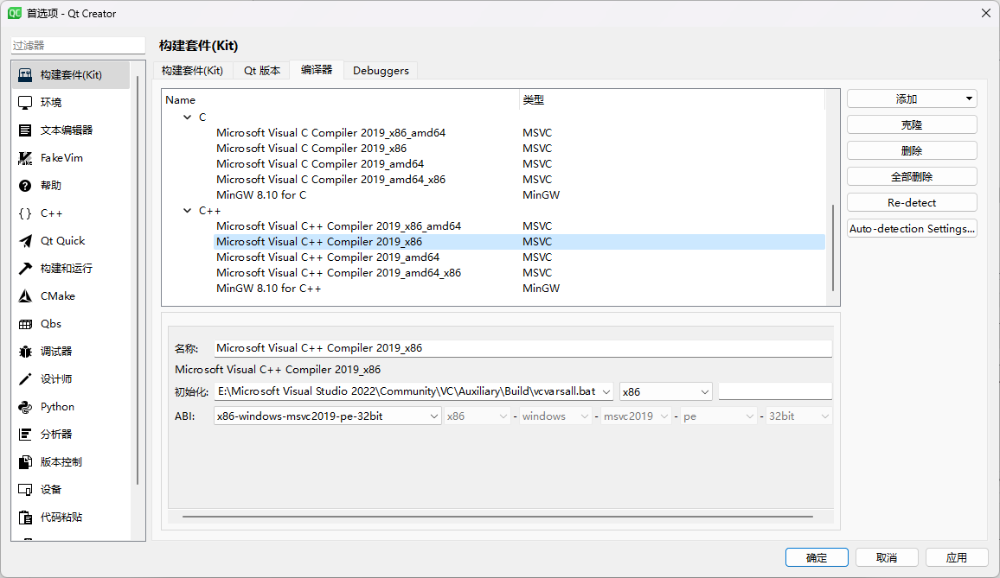

- **Microsoft Visual C++ Compiler 2019_amd64**

- **Microsoft Visual C++ Compiler 2019_amd64_x86**

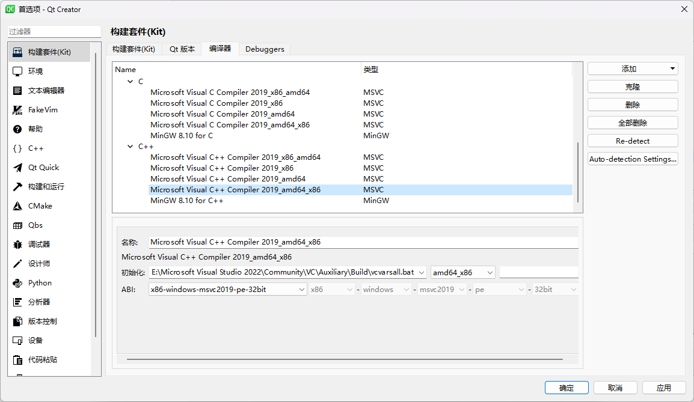

##### 可能存在的问题

可看到自己手动配置的版本都是用的msvc2019，这是因为要配合Qt5.15来使用，好像这个版本的Qt适配的版本就是msvc2019

到时候具体看要用的Qt版本适配msvc20XX，咱就配msvc20XX

可能存在的问题就是自己选“ABI”那一栏的时候，可能没有自己想要的msvc20XX，具体什么原因不清楚

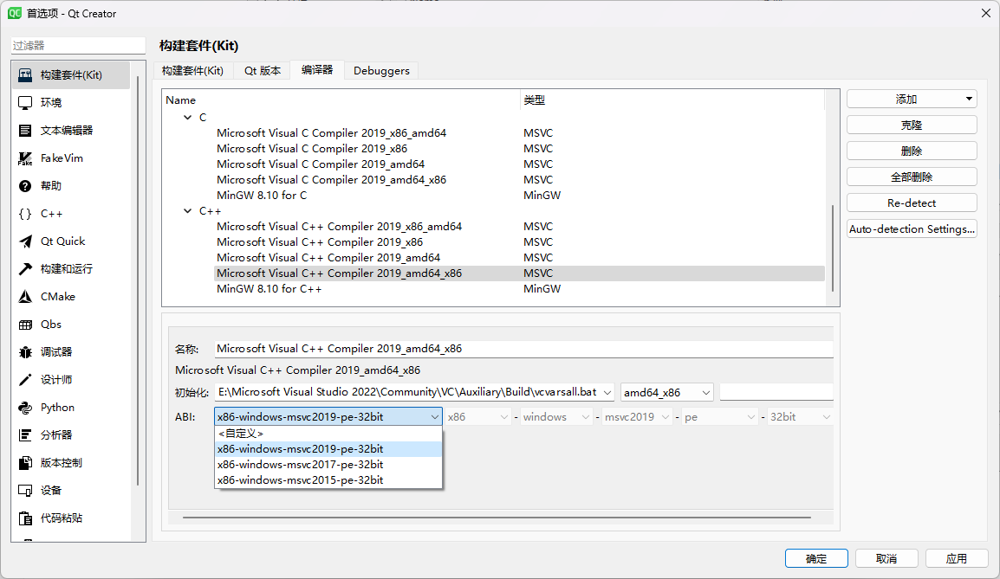

遇到这种情况不要在意，去选ABI中的“<自定义>”，然后就可以自定义后续的选项了

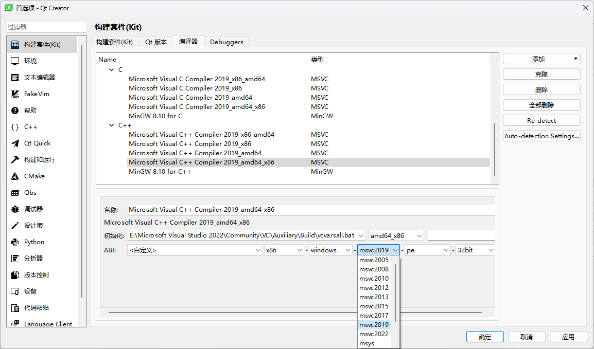

这种时候msvc20XX的可选范围一般就很大了，根据自己的需求选就行

然后其余的选项就对照着前面自动检测到的对应版本来设置就行

### Qt版本

也是根据下面自动检测到的Qt6版本的qmake.exe路径，配置好我们所需的qmake.exe的路径

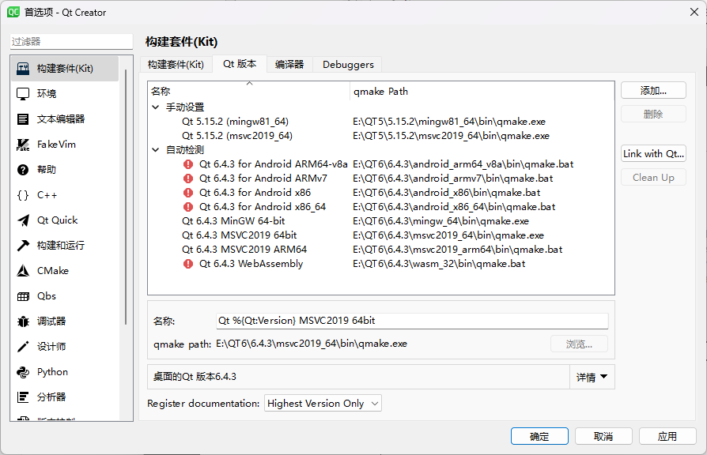

当然根据下面自动检测的来看，如果要用ARM64之类的，可能要配的是qmake.bat的路径，不过一直没用上过，也没仔细研究

### 构建套件（Kit）

上面两步配置好了之后，回到构建套件(kit)一栏，分别配置MinGW和MSVC的开发套件即可

#### **MinGW**

Qt版本选择我们刚才自定义的所需的版本

调试器也选择合适的版本，这个好像就用自动检测到的就行，好像不需太在意几点几版本

然后选择之前配置好的编译器即可，MinGW的编译器选择比较省心，没有多的，就选那俩就行

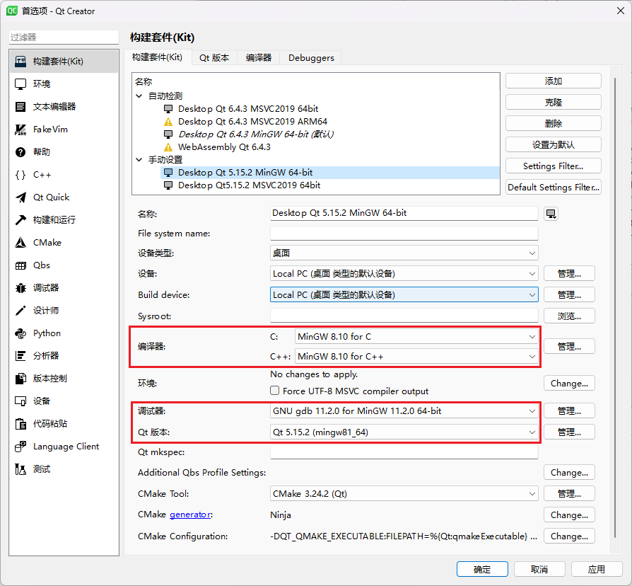

#### **MSVC**

MSVC同理，跟上面大差不差

选择Qt版本

选择调试器，注意MinGW和MSVC的调试器可不一样，这可不能选混了

然后也是要选择对应的编译器

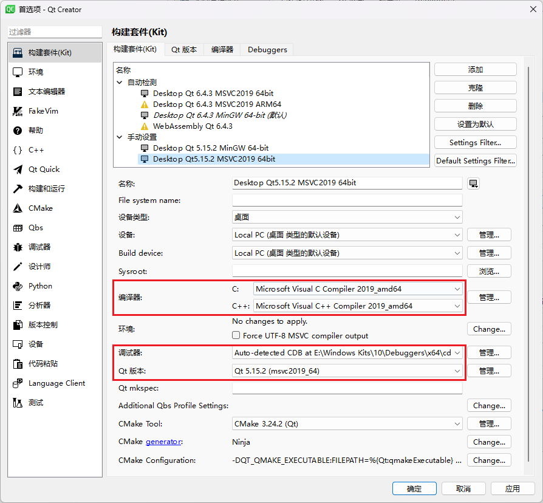

##### 可能存在的问题

这里有个问题，就是因为前面msvc的编译器配了很多个，然后C、C++的还要配合起来才能用，导致不一定哪一个配上好用，这里只能一个一个来试，不过这个试也有一点小技巧

就是看配置前面的图标，像这种小电脑图标就表示配置成功了，可以正常使用

如果是黄叹号标志，就是存在问题，不可用

如果是红色叹号，那就是C和C++没对应起来，也不能用

emm，好像也不算技巧，反正就是看着这个图标来判断能不能行，然后慢慢试

然后因为当时配置编译器那一步，所有自动配置的编译器，其名称、配置都是参考上面编译器名称、配置来的，所以应该是能做到一一对应关系

所以在构建套件（kit）这一步，其实也可以参考自动检测到的可用的开发环境的编译器配置来进行自定义的设置

## 结语

上面一直说的是照着自动检测好的来配置自定义配置

当然其实也可能他自动识别出来的配置不可用，可能还是要上面这样手动配置一下

那个时候虽然步骤跟上面一样，但可能没有可参考的，所以这一笔记也可作为后续配置过程中的参考配置
