## 前言

ccViewer是CloudCompare的一个子项目，负责点云数据的显示部分，可在其基础上专注于增加点云处理功能。

下面介绍如何在VS2022中使用编译好的ccviewer项目作为基础，或者说将其看作是像PCL一样的库来使用。

## 编译源码

因为是需要编译过程中产生的一系列文件，所以需要首先编译Cloud Compare，其中捎带着会把子项目ccViewer也编译了。

具体见之前的博客“编译CloudCompare”

编译用的source、中间生成的build、最终的结果install如下

## VS2022

### 新建项目

因为是在ccviewer基础上，所以第一步先把ccviewer项目涉及到的文件在新建的项目中拷贝一遍

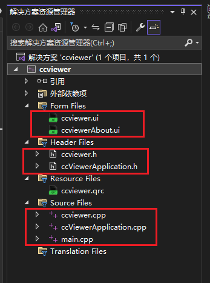

以下是子项目ccviewer原本的文件结构，可以看出就是整个照搬一遍。不过里面具体的代码就是按照自己的需要来改了

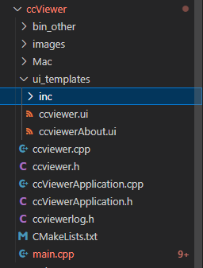

### 配置头文件路径

虽然从上述文件结构来看ccviewer本身没有太多文件，但其中实现具体方法的时候用到了大量的外部文件，外部文件又用到了其他的文件，层层嵌套，导致实际上文件结构很复杂。

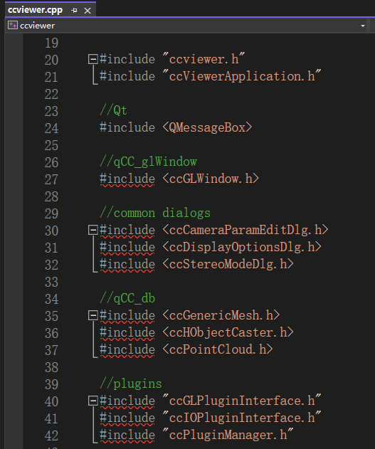

但实际我们无需关注这些文件中的具体实现，我们就把他们当成PCL一样的库来使用即可，所以现在要做的就是像当时配置PCL那类库时一样，配置头文件路径、配置链接器、添加dll文件所在路径到path。不过因为是用编译后的项目来做库，还是有点区别的，后面会提到。

#### 具体过程

具体的配置头文件的路径的过程就是根据错误提示，看找不到的是哪些 .h文件

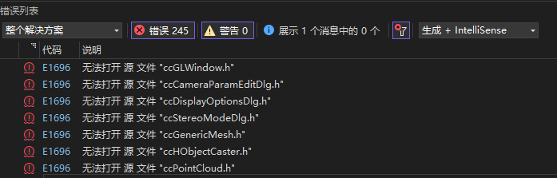

用everything找到文件所在

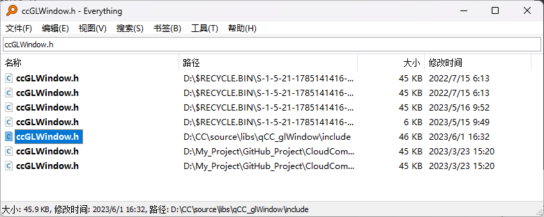

将路径添加到项目属性配置中，C/C++ ->常规->附加包含目录，最终所有的路径如下

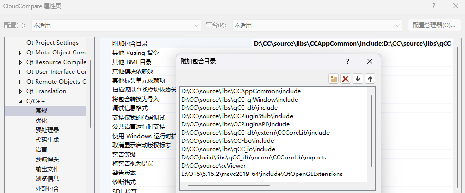

### 配置链接器

根据错误提示中的输出，重点关注图示中括号里面的部分

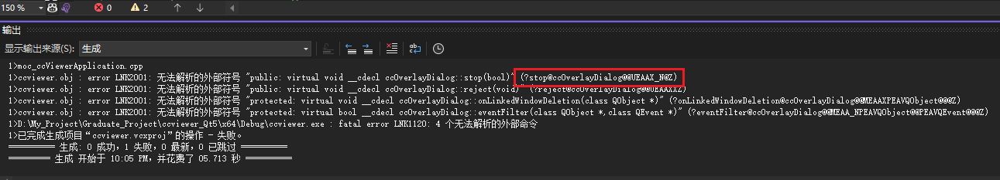

将括号里面的部分复制，使用“Far Manger 3”来搜索含有这部分内容的lib文件

首先定位到大致的搜索位置

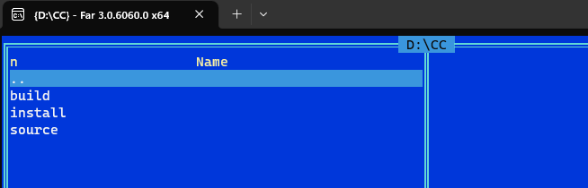

然后点击Commands->Find file，他这个软件上面菜单栏不知道为什么是隐藏的，不用在意，就往那个Commands的位置点就行，就会出来菜单了

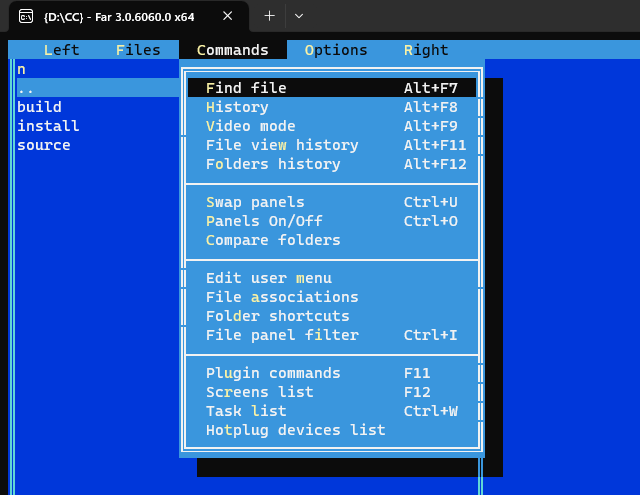

在Containing text中粘贴上面提到的复制的内容，注意不要括号，然后进行搜索

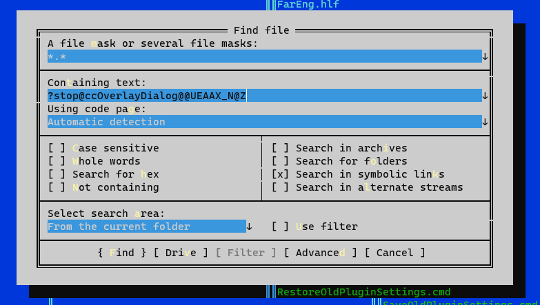

最终找到目标lib

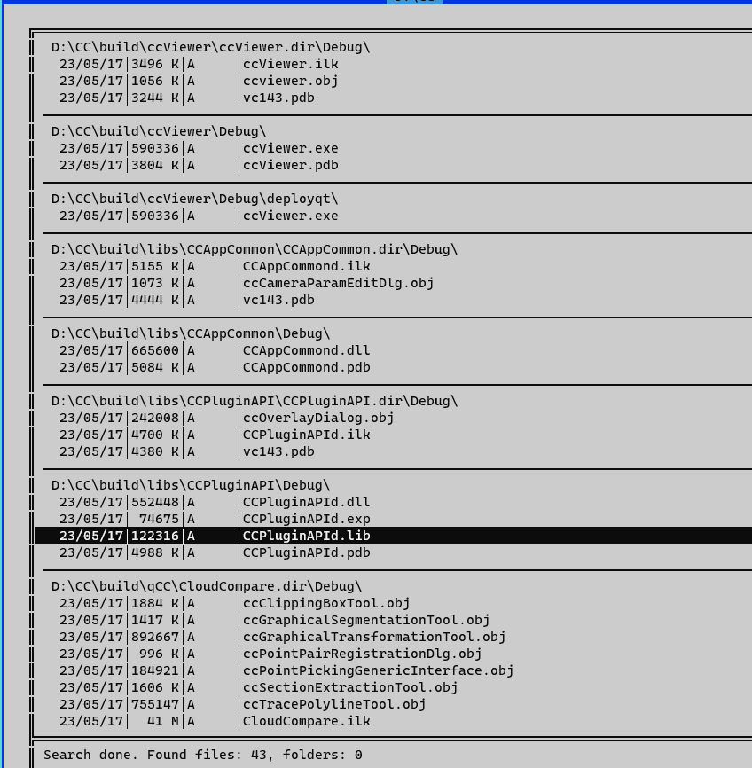

把lib文件名添加到链接器->输入->附加依赖项

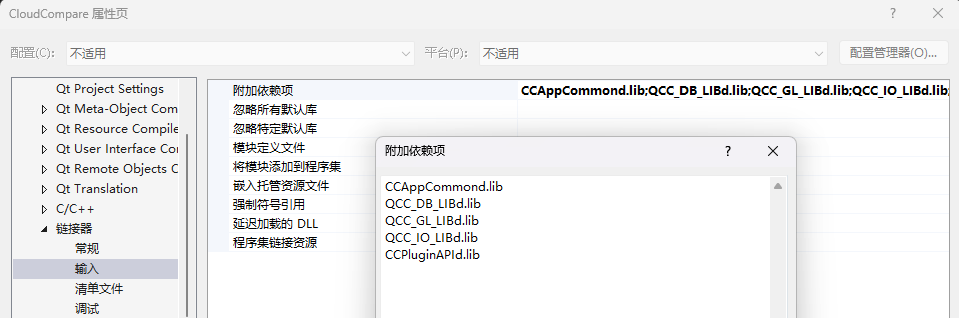

把lib所在路径添加到链接器->常规->附加库目录

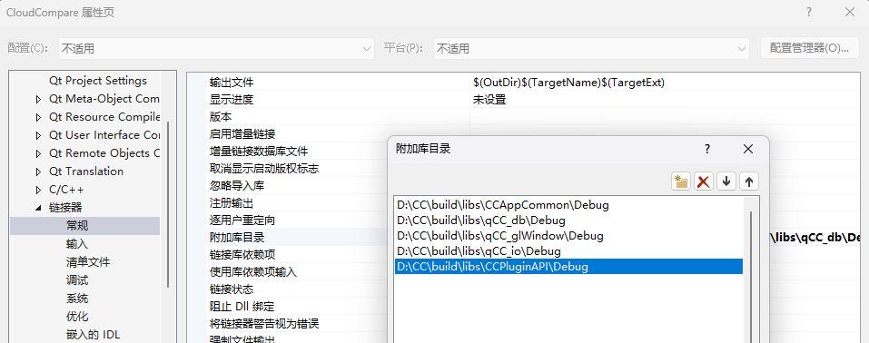

### 配置dll路径

再根据运行时的错误提示找到缺少的dll文件，还是用"everything"来找就行，前面提过跟多次就不细说了

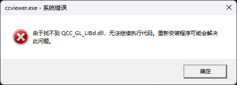

问了后续操作的方便，把缺少的这些dll文件都放到了一个文件夹中CC\bin

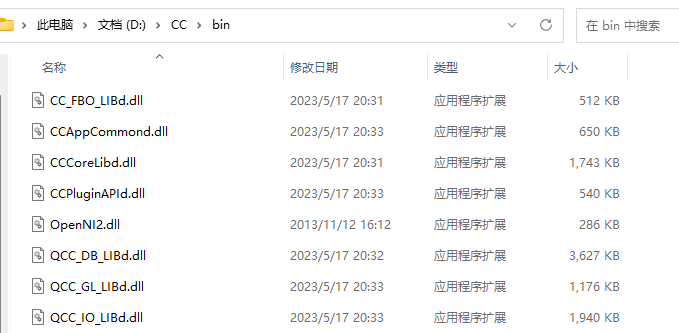

不过实际上这些dll都在一个文件夹D:\CC\install\ccViewer_debug中，就先这样了，后续添加功能可能有其他其他文件夹的dll放进来，省的后续的麻烦了

然后把这个bin路径添加到环境变量path中即可

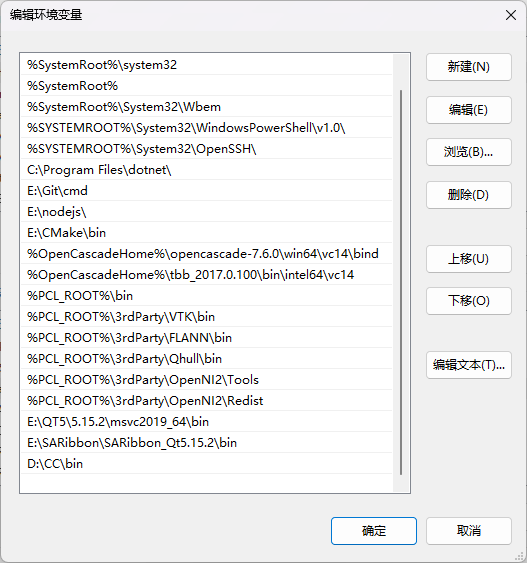

### PCL插件

编译好的ccviewer读取pcd格式依赖于配合pcl生成的插件，所以我们在自己建的项目里也要把那些插件的dll复制过去。

找到编译好的ccviewer程序所在，选中plugins、shaders两个文件夹

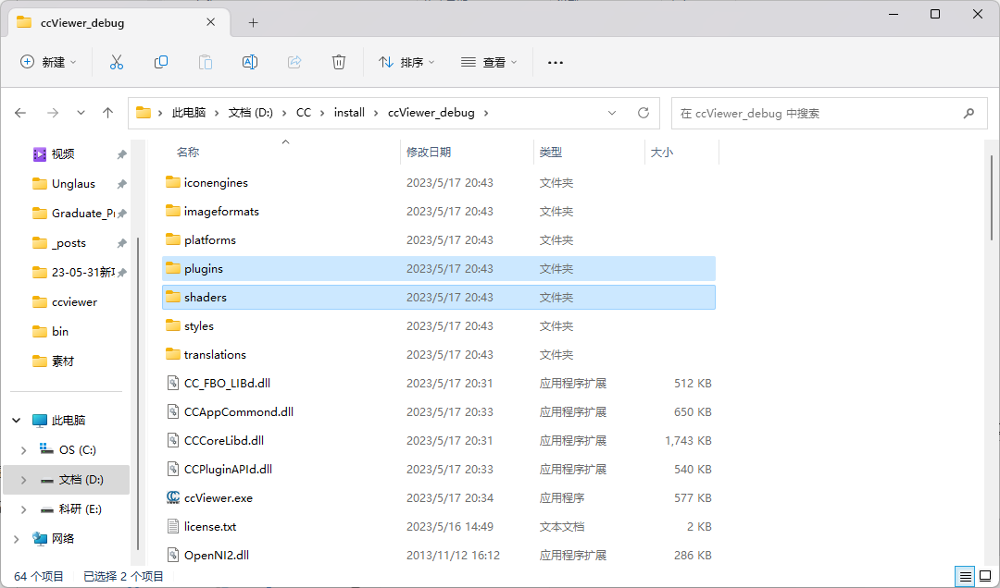

将它们复制到我们新建项目的ccviewer_Qt5\x64\Debug路径下

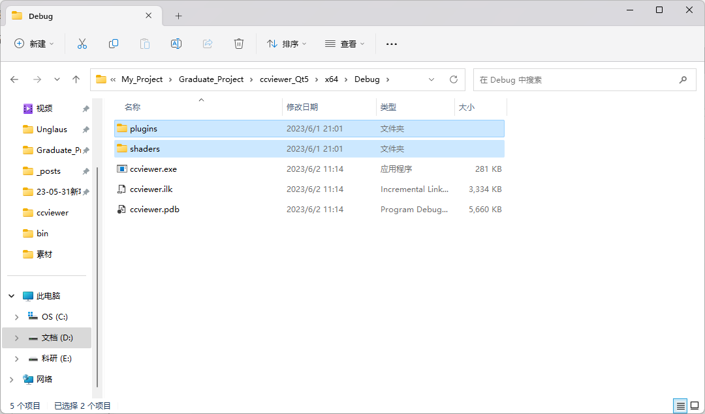

## 后记

至此程序就可以正常运行了，再在此基础上进行二次开发即可

不过程序有些图标没显示，因为没把图标资源文件复制过去，后续研究一下复制到哪里去，待续。。。
