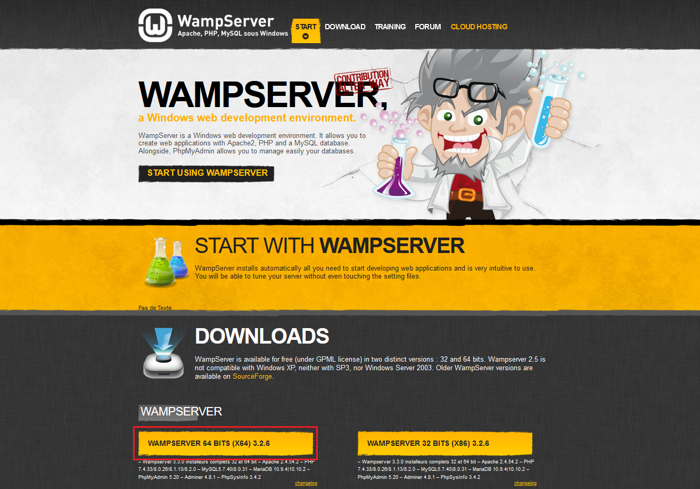
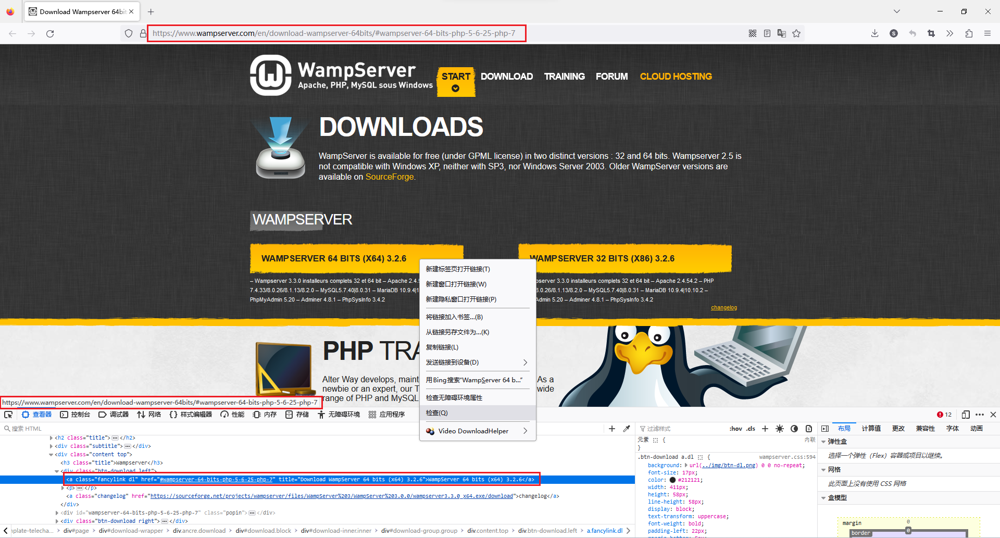
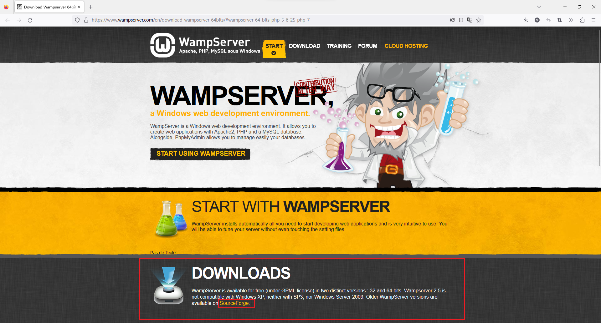
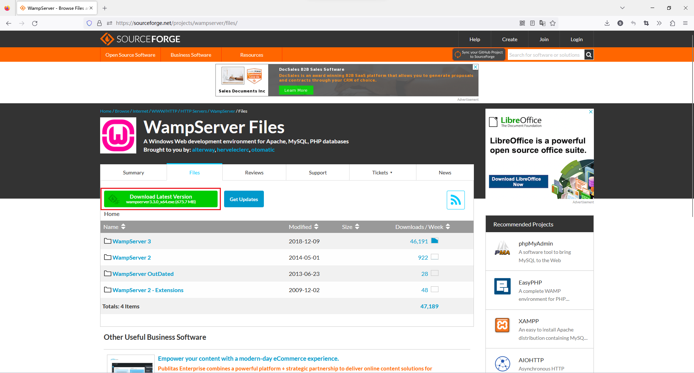
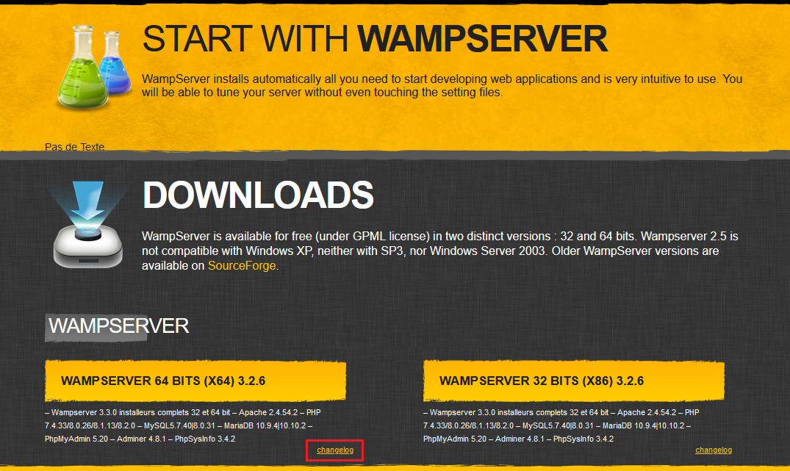

写这个也是想吐槽一下他这个网站的下载设计

下面这个是他官方网站的主页，可以看到下面，下面那么大一个黄色按钮，还写着wamp对应的版本号，一眼看上去就是以为点这个下载

然后点击之后就会发现没什么反应，当时还以为是要挂梯子之类的原因，结果检查这个按钮超链接的路径，发现这个按钮链接的是当前页面，也就是说点这个按钮只是不停的跳转到当前页面而已。。。

那么真正的下载按钮在哪里呢？在黄色按钮上面的“DOWNLOADS”部分，点击“SourceForge”，就会前往真正的下载页面。而且其实读一读“DOWNLOADS”部分里的英文也确实说了让我们去”SourceForge“下载。但是吧。。。就挺搞的。。。

下面就是真正的下载页面了，可以直接点击绿色按钮下载最新安装包即可。有其他需求的也可以去下面各个文件夹看一看，看看有没有自己需要的东西。

补充：后面发现点击黄色按钮右下角的”changelog“也可以，会自动跳转到对应版本的下载页面，等待5s后会自动开始下载

题外话，上面说的对应版本指的是64位、32位这个，不是指wamp版本号。因为可以看到黄色按钮明明写着3.2.6，下面小字说的却是3.3.0，然后实际安装时，安装包的版本也是3.3.0的。当然这也没什么所谓，就是吐槽一下。