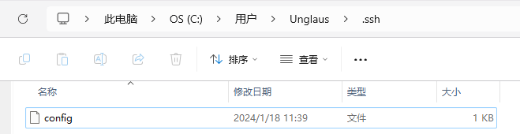

## ssh: connect to host github.com port 22: Connection refused

今天在用git往github同步笔记的时候，在`git push`一步的时候失败了，并提示：

```bash
$ git push
ssh: connect to host github.com port 22: Connection refused
fatal: Could not read from remote repository.

Please make sure you have the correct access rights
and the repository exists.
```

这个错误提示的是连接`github.com`的22端口被拒绝了。

不知道是哪里出了问题，怎么会突然22端口就不让访问了？

### **使用GitHub的443端口**

22端口可能被防火墙屏蔽了，可以尝试连接GitHub的443端口。

~~~bash
$ vim ~/.ssh/config
```
# Add section below to it
Host github.com
  Hostname ssh.github.com
  Port 443
```
~~~

这个解决方案的思路是：给`~/.ssh/config`文件里添加如下内容，这样ssh连接GitHub的时候就会使用443端口。

如果`~/.ssh`目录下没有config文件，执行`$ vim ~/.ssh/config`得到结果如下：


因为对vim不太熟，不太知道这是个上面界面。。。不知道该如何往下做了。。。

这时候可以退出去，按下面步骤来：

```bash
$ cd ~/.ssh
$ vim config
```

这样会先进入到`.ssh`文件夹下，然后`$ vim config`会打开config文件，如果没有该文件，则会新建一个该文件，并进入


进入后大概是这样，输入"`i`"进入`insert`模式，就可以开始编辑文本了，把之前提到的文本输入进去

```bash
Host github.com
Hostname ssh.github.com
Port 443
```

编辑完内容后，按"`esc`"退出键，回到普通模式

在普通模式输入`:w`即可保存编辑内容

顺便提一嘴其他的命令：

- `:q`是退出vim编辑器，但如果你改过了其中的内容，就算是你添加了个'a'，然后又删了，恢复原样也不行，就只有进入过编辑模式，这个命令就没法正常退出，vim编辑器会给给你报错，拦着你，这也是怕你忘了保存直接退出
- `:q!`这个就是强制退出vim编辑器，不会保存之前编辑的内容
- `:wq`保存并退出，`:w`和`:q`的组合

具体的vim相关教程见[菜鸟教程](https://www.runoob.com/linux/linux-vim.html)

***

再顺便提一嘴，上面都是用代码创建config的，但其实上述的文件位置就在C盘下：`C:\Users\Unglaus\.ssh\`，不过其实只是知道文件路径位置，让我自己创建我也不知道这个config是要创建个什么格式的文件，因为这文件创建出来后面都没有后缀名的。。。



***

修改完`~/.ssh/config`文件后，使用`ssh -T git@github.com`来测试和GitHub的网络通信是否正常，如果提示`Hi xxxxx! You've successfully authenticated, but GitHub does not provide shell access.` 就表示一切正常了。

```bash
$ ssh -T git@github.com
```

```bash
Hi xxxxx! You've successfully authenticated, but GitHub does not
provide shell access.
```

到这里我的问题就解决了，不过看网上也有可能继续提示端口443也不好用的情况。。。

***

这样的话可能只能试试另一种方法，就是不用ssh协议，改用http协议的。

但不是很推荐，因为看到有很多教程是用http协议连不上GitHub，教着怎么改成ssh协议来连GitHub的。。。
