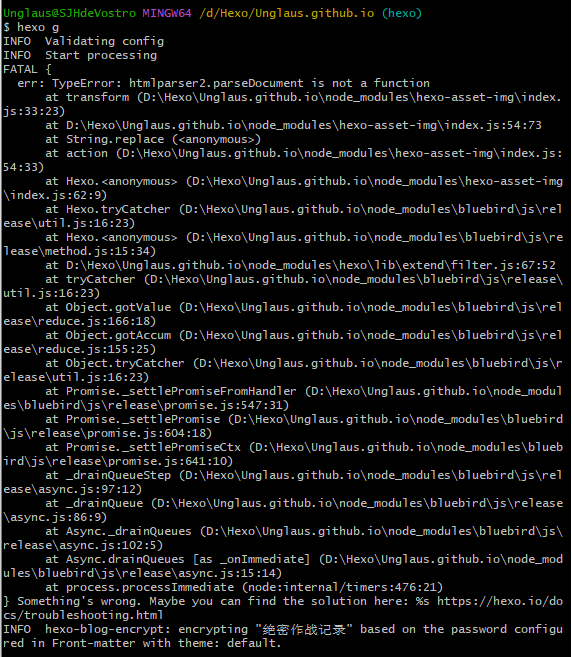
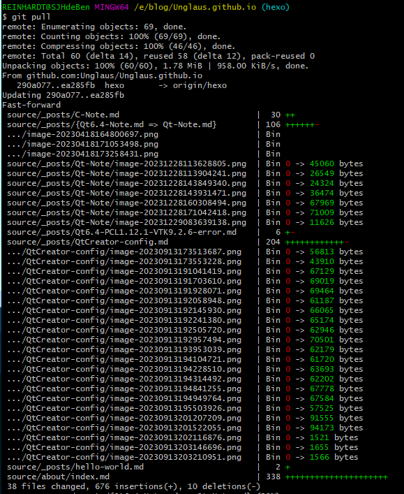
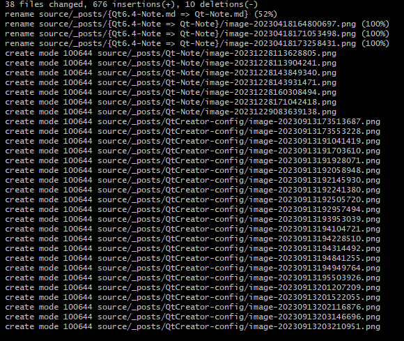
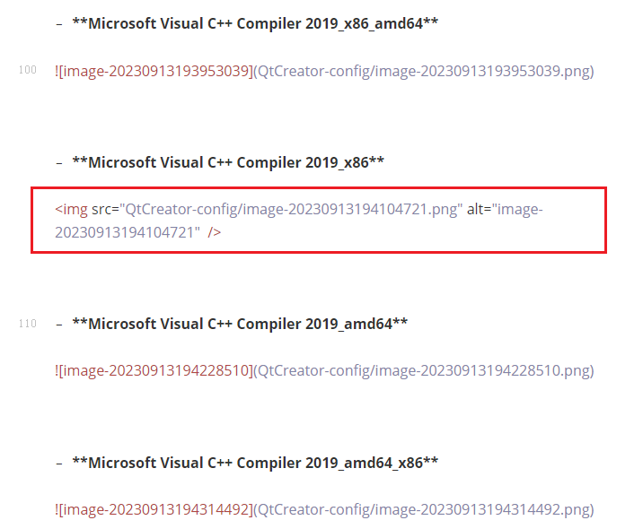

## 发现问题

好久没有更新hexo博客了，因为`hexo -d`经常要试好几次才能传上去，有点懒得搞了，所以只把笔记`git push` 到Github上就结束了

这天想着攒了不少了，更新一下hexo博客，结果`hexo -g`的时候出了很奇怪的错



上网找了找相关的问题，没有完全一样的，只找到一个也是说`hexo -g`的时候有奇怪的错误，不过跟我报的错不一样。

他遇到的问题，删除hexo的所有依赖，即删除“node_modules”文件夹，然后重新安装一遍所有依赖，就解决了。

记录一下安装依赖的命令，以防后面有用：

```bash
npm install hexo --save
```

## 排查过程

然后我想起来宿舍电脑上的hexo文件夹好久没动了，一直保持后就之前没更新的状态，去试了一下，发现那台电脑上可以正常`hexo -g`

就想到估计是新写的一些md笔记出了点问题，然后用了一下`git pull`，看看更新了哪些笔记





从上面可以看到，主要改动的就是"`index.md`"，"`hello-world.md`"，"`C-Note.md`"，"`Qt-Note.md`"，"`Qt6.4-PCL1.12.1-VTK9.2.6-error.md`"，"`QtCreator-config.md`"这几篇文章更新了。

我就把它们都移出文件夹，然后`hexo -clean`，`hexo -g`试了一下，发现果然好了，那问题就出在他们其中

**因为我本来以为是不是哪个配置文件出问题了，或者hexo哪个组件升级了还是咋，导致的，想着重装一遍hexo呢，这样看来就是文件的问题**

确定了问题范围之后，我就把他们分别一个一个移进文件夹里，并用`hexo -clean`，`hexo -g`测试

最后锁定是**`QtCreator-config.md`**中哪个地方出了问题

## 进一步排查

找到具体的文件`QtCreator-config.md`之后，把这个有问题的原文件放在外面，里面"_post"文件夹新建一个同名文件，然后一段一段的从原文件复制到这个新文件，并用`hexo -clean`，`hexo -g`测试

复制的时候用的代码模式查看，方便一点

最后发现有一段插入图片的代码跟别人都不一样



别的图片都是正常的用Markdown语法插入的，这一个图片不知道为什么是用html格式插入的。。。

然后把这段图片插入代码改成了Markdown风格，果然问题就解决了。。。

## 总结

是由于图片插入的时候，使用了html的语法，导致hexo调用node_modules里的相关插件进行格式转换的时候出现了问题

（ps：hexo通过node_modules里的插件，把本地的md文件转换成html语言，在网页上显示出来）

以后遇到类似问题，可以试着在"代码模式"下检查一下图片的插入语法是否有问题

不过我到底是没想起来，当时是怎么搞的，让这一张图片的插入语法变成了html语法。。。
